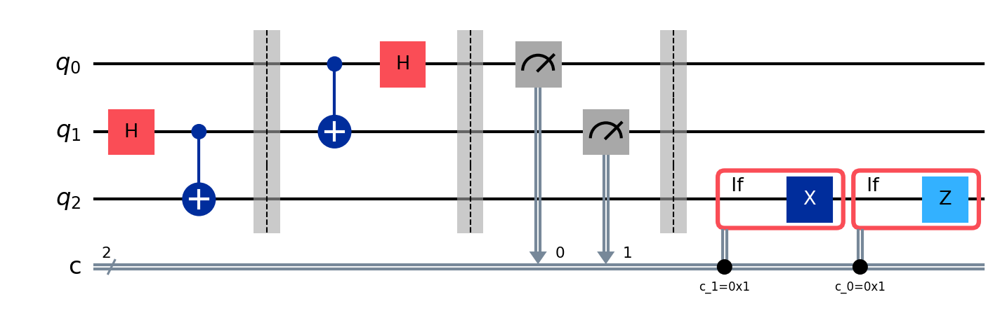
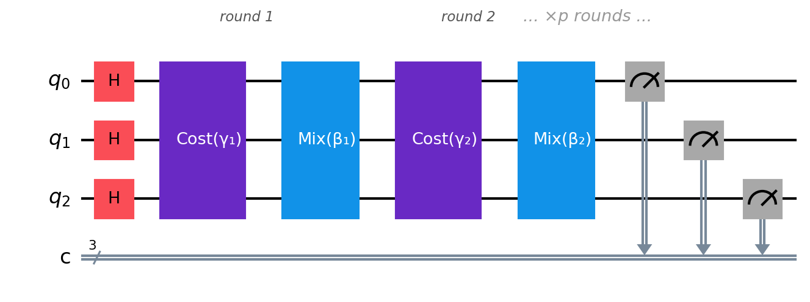
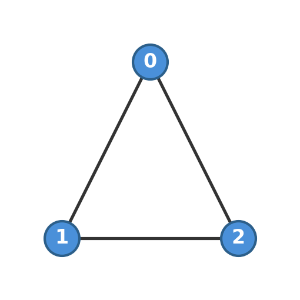

# Unit 1: Logistics — *Saving $50 Million One Mile at a Time*

## The Hook

Every morning, 130,000 UPS drivers leave their depots. Each driver visits between 100 and 200 stops. The order they visit those stops determines how many miles they drive, how much fuel they burn, and whether they make it home for dinner.

In 2012, UPS deployed a system called ORION: On-Road Integrated Optimization and Navigation. Its job: take each driver's list of deliveries and produce a better route. Not a perfect route. Just a better one. ORION shaved an average of one mile off each driver's daily route.

One mile doesn't sound like much. But multiply by 130,000 drivers, 250 working days per year, and the cost of fuel, vehicle wear, and driver time. UPS reported savings of **$50 million per year** from that single mile.

Now consider what a *two*-mile improvement would be worth. Or five.

The problem is that finding the optimal route isn't just difficult; it's one of the hardest problems in all of computer science. If a driver has 20 stops, there are $20! = 2.4 \times 10^{18}$ possible orderings. That's 2.4 quintillion routes to check. A desktop computer evaluating one billion routes per second would need 77 years. For 50 stops, the number of possibilities exceeds the number of atoms in the observable universe.

This is the **Travelling Salesman Problem** (TSP), and it has tormented mathematicians, computer scientists, and logistics companies for over a century. Every exact algorithm for TSP has a running time that grows at least exponentially with the number of stops. There is strong theoretical evidence (though no proof) that no efficient exact algorithm exists; the problem is NP-hard.

In practice, nobody solves TSP exactly at scale. ORION doesn't find the best route; it finds a *pretty good* route, using a toolkit of sophisticated heuristics — from simulated annealing to specialised graph algorithms — that have been refined over decades.

They work remarkably well. But they all share a fundamental limitation: they explore the space of routes *one at a time*. They walk through the landscape of possible solutions, stepping from one candidate to a neighbouring one, hoping that local improvements lead to global ones. Sometimes they get stuck in valleys; solutions that are better than all their neighbours but far worse than the global optimum.

What if you could explore the entire landscape at once?

## The Bottleneck

Let's make the problem concrete. Strip away the geography and the delivery trucks, and what remains is pure combinatorics.

You have a graph; a set of cities (nodes) connected by roads (edges), each road with a cost (the distance). You want to visit every city exactly once and return to where you started, minimising the total cost. That's TSP.

For our purposes, let's start with something even simpler: **MaxCut**. Take a graph and colour every node either red or blue. An edge is "cut" if its endpoints have different colours. MaxCut asks: what colouring cuts the most edges?

MaxCut sounds like it has nothing to do with delivery trucks. But TSP, MaxCut, and virtually every combinatorial optimisation problem share the same deep structure: you have $n$ binary decisions, a cost function that depends on how those decisions interact, and an exponentially large space of possibilities to search. The difference is just what the decisions represent (which city to visit next vs. what colour to assign) and what the cost counts (total distance vs. cut edges). The quantum approach we're about to build works on *any* problem with this structure. We're using MaxCut because it's the cleanest example — each decision is one qubit, and the cost function translates directly into the language of quantum mechanics. Once you see how QAOA handles MaxCut, the path to TSP, vehicle routing, and scheduling is a change of cost function, not a change of algorithm.

Here's why MaxCut is hard. Each node is coloured one of two colours, so an $n$-node graph has $2^n$ possible two-colourings. For each colouring, you can count the cut edges in $O(m)$ time, where $m$ is the number of edges. So the brute-force algorithm takes $O(m \cdot 2^n)$ time. For $n = 50$, that's roughly $10^{15}$ operations; doable but slow. For $n = 100$, it's $10^{30}$ operations. For $n = 300$, you'd need more time than the age of the universe.

The problem is the search space. Every node is a binary decision: red or blue, 0 or 1. The decisions interact; the value of your choice for node $i$ depends on what you chose for nodes $j$, $k$, $l$; every node that shares an edge with $i$. These interactions create a rugged *cost landscape*: a function over $\{0,1\}^n$ with exponentially many local optima.

Classical heuristics navigate this landscape by making local moves. Flip one node's colour. If the cut count improves, keep it; otherwise, try another flip. Simulated annealing adds randomness; occasionally accept a worse solution to escape local optima, gradually reducing the randomness as you "cool down."

These methods are powerful, but they have a fundamental weakness: they explore the landscape *sequentially*. At any moment, they're sitting at a single point in the space of $2^n$ possible colourings. They can only see the immediate neighbourhood. A better solution might exist on the other side of a high barrier, and no amount of local flipping will find it.

This is where the story turns quantum.

## The Quantum Angle

What if, instead of sitting at one colouring and looking around, you could be at *all* $2^n$ colourings simultaneously, and then use interference to amplify the ones that cut more edges?

That's the core idea behind the **Quantum Approximate Optimization Algorithm** (QAOA), introduced by Farhi, Goldstone, and Gutmann in 2014. It's not a magic bullet; it won't solve NP-hard problems in polynomial time (nobody believes that's possible). But it offers a fundamentally different way to explore the solution landscape, one that exploits quantum mechanics in a structural way that classical algorithms cannot mimic.

Before we dive into QAOA itself, let's step back and sketch how quantum algorithms work in general. Nearly every quantum algorithm follows the same three-act structure:

1. **Encode** the problem into a quantum system. Binary decisions become qubits. Costs become operators. The search space becomes the space of quantum states.
2. **Manipulate** the quantum state using carefully chosen operations. This is where the quantum magic happens: interference suppresses bad solutions and amplifies good ones, without ever looking at them one by one.
3. **Measure** the result. Measurement collapses the quantum state to a single classical answer. If the manipulation was done well, that answer is likely to be a good one.

That's the whole recipe. The art is in step 2, and it's different for every algorithm. For QAOA, the manipulation is a rhythmic alternation between "imprint the cost" and "mix the solutions." For Shor's algorithm (Unit 2), it's a Fourier transform. For VQE (Unit 3), it's a chemistry-inspired trial state. But the three-act structure is always the same.

Let's see how it plays out for MaxCut.

### Qubits as binary decisions

The first step is encoding. Each node in the graph gets one qubit. A classical bit is either 0 or 1. A qubit is the quantum version: it has two definite states, which physicists write as $|0\rangle$ and $|1\rangle$. The vertical bar and angle bracket are just packaging — the notation is called a "ket," and it's how physicists label quantum states. You can read $|0\rangle$ as "the state labelled zero" and $|1\rangle$ as "the state labelled one." When you measure a qubit, you always get one of these two outcomes: 0 or 1, just like a classical bit. The difference is what happens *before* you measure — but we'll get to that in a moment.

For MaxCut, $|0\rangle$ means "red" and $|1\rangle$ means "blue." An $n$-node graph requires $n$ qubits. A specific colouring — say, nodes 1 and 3 are blue, node 2 is red — corresponds to the quantum state $|101\rangle$ (just the individual qubit labels strung together).

So far, this is just notation. The quantum part starts when we use *superposition*.

> **Superposition.** A qubit doesn't have to be $|0\rangle$ or $|1\rangle$. It can be in a state like $\alpha|0\rangle + \beta|1\rangle$, where $\alpha$ and $\beta$ are numbers (complex, if you care, but the intuition works with real numbers) satisfying $|\alpha|^2 + |\beta|^2 = 1$. The values $|\alpha|^2$ and $|\beta|^2$ are the probabilities of getting 0 or 1 when you measure. Before measurement, both possibilities coexist. This isn't a metaphor; it's how the physics works. When you put $n$ qubits into superposition, the system represents all $2^n$ possible states at once. You'll hear people say "the quantum computer tries all answers simultaneously." That's misleading. What really happens is subtler: the $2^n$ possibilities can *interfere* with each other, and clever algorithms arrange for the good answers to reinforce and the bad ones to cancel. Deep-Dive 1 makes this precise.

With $n$ qubits in superposition, we have all $2^n$ colourings present in a single quantum state. We can't look at them all; measurement gives us just one. But between preparation and measurement, we can manipulate the amplitudes to make good colourings more likely to appear. That's the game.

### Turning costs into energy

Now we need to tell the quantum computer what "good" means. We need to translate the MaxCut objective; "cut as many edges as possible"; into something a quantum system can work with.

Physicists have a word for "the function that assigns a number to every state of a system": they call it a **Hamiltonian**. In physics, the Hamiltonian describes the total energy, and the system naturally evolves toward its lowest-energy state. We're going to borrow this idea: assign an "energy" to every colouring, where lower energy means more edges cut. Then "find the best colouring" becomes "find the lowest-energy state."

This reframing is not just convenient; it's the key insight that makes quantum optimisation work. Quantum mechanics provides natural machinery for exploring energy landscapes — the Hamiltonian governs how a quantum system evolves, and the tools of quantum computing let us steer that evolution toward low-energy states. By encoding our problem as a Hamiltonian, we're harnessing this machinery for optimisation.

Here's how we build the Hamiltonian for MaxCut. For each edge $(i, j)$, we need an expression that equals 1 when the edge is cut and 0 when it isn't. The trick uses a quantum operator called $Z$ (the Pauli-$Z$ operator, which gives $+1$ for $|0\rangle$ and $-1$ for $|1\rangle$):

$$\frac{1 - Z_i Z_j}{2}$$

Does it work? Check all four cases:

| $q_i$ | $q_j$ | Same colour? | $Z_i$ | $Z_j$ | $Z_i Z_j$ | $\tfrac{1}{2}(1 - Z_i Z_j)$ |
|:---:|:---:|:---:|:---:|:---:|:---:|:---:|
| $\vert 0\rangle$ (red) | $\vert 0\rangle$ (red) | yes | $+1$ | $+1$ | $+1$ | $0$ — uncut |
| $\vert 0\rangle$ (red) | $\vert 1\rangle$ (blue) | no | $+1$ | $-1$ | $-1$ | $1$ — **cut** |
| $\vert 1\rangle$ (blue) | $\vert 0\rangle$ (red) | no | $-1$ | $+1$ | $-1$ | $1$ — **cut** |
| $\vert 1\rangle$ (blue) | $\vert 1\rangle$ (blue) | yes | $-1$ | $-1$ | $+1$ | $0$ — uncut |

The formula returns 1 exactly when the edge is cut and 0 when it isn't. That's all we need.

The total cost Hamiltonian sums this over every edge:

$$C = \sum_{(i,j) \in E} \frac{1 - Z_i Z_j}{2}$$

The state with the highest value of $C$ is the colouring that cuts the most edges. Equivalently, the **ground state** of $-C$ (the lowest-energy state) is the optimal solution.

This pattern; "encode the objective as a Hamiltonian, then find its ground state"; is the central trick of quantum optimisation, and it recurs throughout this book. In Unit 3, the Hamiltonian encodes molecular energy. In Unit 6, it encodes scheduling constraints. In Unit 7, it encodes the physics of a material. The problems are different, but the strategy is the same: translate "find the best X" into "find the lowest energy."

### Reading a quantum circuit

Before we look at the QAOA circuit, a quick orientation on how quantum programs are drawn.

A quantum circuit is read left to right, like sheet music. Each horizontal line (called a **wire**) represents one qubit. Boxes or symbols on the wires represent **operations** (also called gates). A gate on one wire acts on that qubit alone; a gate connecting two wires (drawn with a vertical line between them) acts on both qubits together. At the end, a measurement symbol ($M$ or a meter icon) reads out the qubit's value as a classical 0 or 1.

Here's what that looks like in practice. The circuit below implements **quantum teleportation** — moving the state of one qubit to another using entanglement and two classical bits. You don't need to understand it yet; just notice the structure:

Three wires, three qubits. Gates ($H$, CNOT) sit on the wires at specific moments in time. The grey arrows carry classical measurement results down to later gates. Read left to right, the circuit tells you exactly what happens and when — just like a musical score tells musicians what to play and when. This is the visual language for every quantum algorithm in the book.

> **Unitary.** You'll see quantum operations called "unitary." This is a technical term from linear algebra that means two things: the operation is *reversible* (you can always undo it), and it *preserves probabilities* (they still add up to 1 afterwards). Every quantum gate is unitary. Measurement is not; it's the one irreversible step, where the quantum state collapses to a definite classical value. Deep-Dive 1 goes deeper into the mathematics.

A few gates we'll meet repeatedly:

- $H$ (Hadamard): puts a qubit into superposition. Turns $|0\rangle$ into an equal mix of $|0\rangle$ and $|1\rangle$.
- $Z$ (Pauli-Z): you've already met this; it gives $+1$ for $|0\rangle$ and $-1$ for $|1\rangle$. Related gates $R_Z(\theta)$ rotate by a tunable angle.
- $X$ (Pauli-X): flips a qubit; $|0\rangle \to |1\rangle$ and vice versa. Related gate $R_X(\theta)$ rotates by a tunable angle.
- CNOT: a two-qubit gate that flips the second qubit if the first is $|1\rangle$. This is how qubits become *entangled*; correlated in ways that have no classical analogue.

With that vocabulary, let's look at the QAOA circuit.

### The QAOA circuit

Here is the entire QAOA algorithm for our three-node MaxCut problem:

Read left to right. Initialise, then alternate between two boxes — Cost and Mix — for $p$ rounds, each round with its own pair of angles ($\gamma_k$, $\beta_k$). Then measure. That's the entire algorithm. The angles are different in every round: round 1 uses $\gamma_1, \beta_1$; round 2 uses $\gamma_2, \beta_2$; and so on. There are $2p$ parameters in total, and choosing them well is the whole game. We'll get to that. First, let's open each box.

**Box 1: Initialisation.** A Hadamard gate $H$ on every qubit. This creates an equal superposition of all $2^n$ colourings, each with the same amplitude $1/\sqrt{2^n}$. Think of it as a blank canvas: every possible solution is present, and none is preferred. If you measured right now, you'd get a uniformly random colouring. Not useful yet.

**Box 2: The cost phase** ($e^{-i\gamma_k C}$). This is where our Hamiltonian earns its keep. For each edge $(i,j)$, the circuit applies a rotation whose angle is proportional to $\gamma_k$. The effect: every colouring in the superposition picks up a *phase* that depends on its cut count. Colourings that cut more edges get one phase; colourings that cut fewer get a different phase.

But here's the catch: phase changes alone are invisible to measurement. The *probabilities* haven't changed at all. If you measured right now, you'd still get a uniformly random colouring. The cost phase has written information in invisible ink: it tagged good solutions differently from bad ones, but the tags are hidden in the phases, and measurement only sees probabilities.

So what good are the phases? This is where interference enters.

> **Interference.** Quantum amplitudes aren't just numbers — they have both a magnitude and a *direction* (technically, a complex phase). Think of them as arrows. When two arrows point the same way, they reinforce: their magnitudes add. When they point in opposite directions, they cancel: their magnitudes subtract. This is *interference*, and it's the mechanism that makes quantum computing fundamentally different from classical computing.
>
> Superposition gives you the blank canvas — all $2^n$ solutions present at once. But superposition alone is useless: you can't look at all the solutions, and a random one is no better than a coin flip. Interference is what sculpts the canvas. It converts the phase information (which solution is good, which is bad) into probability information (which solution you're likely to measure). Every quantum algorithm is, at its core, an interference machine — and this is the pattern for every chapter in this book: encode the problem, let interference amplify the right answer, measure. The details differ — Shor's algorithm uses the Quantum Fourier Transform to create constructive interference at the period. Grover's uses the diffusion operator. QAOA uses the mixer. But the trick is always the same: arrange for good answers to reinforce and bad answers to cancel.

**Box 3: The mixer** ($e^{-i\beta_k B}$). An $R_X(2\beta_k)$ rotation on every qubit. This "stirs" the superposition, causing amplitudes from different colourings to overlap and interfere. Because the cost phase tagged good colourings with different phases from bad ones, the mixer's stirring produces constructive interference for high-cut colourings and destructive interference for low-cut ones. After the mixer, the probabilities are no longer uniform: good solutions are more likely to appear when you measure.

**Then repeat.** One round of cost-then-mix shifts the probabilities a little. Two rounds shift them more. Each round uses fresh angles ($\gamma_k$, $\beta_k$), so the algorithm can tag and stir with different intensities at each step — like a photographer adjusting focus and exposure between shots. In the limit $p \to \infty$ with optimally chosen parameters, QAOA can in principle reach the exact optimum. In practice, you use a small $p$ and accept an approximate answer — hence "Approximate" in the name.

But who chooses the $2p$ angles? You could try random values, but that's wasteful. Instead, QAOA uses a **variational loop** — a quantum-classical hybrid:

1. Pick initial values of $\gamma_1, \beta_1, \ldots, \gamma_p, \beta_p$
2. Run the quantum circuit, measure the output
3. Compute the expected cost (run many times, take the average)
4. Feed this cost to a classical optimiser (COBYLA, Nelder-Mead, gradient descent)
5. The optimiser suggests better angles
6. Repeat until convergence

The quantum computer explores the solution space. The classical computer tunes the exploration strategy. Neither could do the other's job efficiently.

For the gate-level decomposition of each box — how the cost phase becomes a sequence of CNOTs and $R_Z$ rotations, and what $R_X$ does geometrically — see Deep-Dive 1.

## Worked Example

Let's solve MaxCut on a triangle; three nodes, three edges. The optimal cut is 2 (colour one node differently from the other two).

### The graph

Three nodes, three edges: (0,1), (0,2), (1,2). Each node gets one qubit.

### The cost Hamiltonian

$$C = \frac{1 - Z_0 Z_1}{2} + \frac{1 - Z_0 Z_2}{2} + \frac{1 - Z_1 Z_2}{2}$$

### What QAOA produces

Using pre-optimised parameters ($\gamma \approx \pi/4$, $\beta \approx \pi/8$), a single round of QAOA produces this measurement distribution:

| Outcome | Cut value | Probability |
|---------|-----------|-------------|
| 000 | 0 | ~3% |
| 001 | 2 | ~16% |
| 010 | 2 | ~16% |
| 011 | 2 | ~16% |
| 100 | 2 | ~16% |
| 101 | 2 | ~16% |
| 110 | 2 | ~16% |
| 111 | 0 | ~3% |

The colourings with cut value 2 (the optimum for the triangle) are amplified. The "all same" colourings ($000$, $111$) are suppressed. QAOA has shifted probability mass toward the optimal solutions.

→ *The next chapter builds this circuit gate by gate, runs it, and shows you the code.*

### Back to the trucks

We started with UPS drivers and 20-stop routes. We solved MaxCut on a triangle. How do you get from one to the other?

The same machinery applies. TSP and its industrial cousin, the **Vehicle Routing Problem** (VRP), can be written as cost functions over binary variables — which city does driver $k$ visit at time step $t$? The cost Hamiltonian becomes a sum of distance terms plus penalty terms that enforce constraints (visit every city exactly once, return to the depot, respect vehicle capacity). The encoding is more complex than MaxCut — you need $O(n^2)$ qubits instead of $n$, and the constraint penalties add terms to the Hamiltonian — but the algorithm is identical: initialise in superposition, alternate cost and mixer phases, measure. QAOA doesn't care whether the cost function counts cut edges or travel distance. It just needs a Hamiltonian.

That's also why we'll see this same pattern in every unit of this book. Drug molecules, financial portfolios, nurse schedules, material properties — they all become Hamiltonians, and the quantum algorithm searches for the ground state. The problem changes. The strategy doesn't.

## Reality Check

Let's be honest about where QAOA stands; and where it's heading.

**At low depth, QAOA underperforms classical methods.** For depth-1 QAOA on MaxCut, the guaranteed approximation ratio is 0.6924 for 3-regular graphs. The best classical polynomial-time algorithm (Goemans-Williamson) achieves 0.878. If you can only run one or two rounds, you're better off classical.

**At high depth, QAOA is competitive.** Performance improves monotonically with depth $p$, and recent work has computed exact QAOA performance through depth $p = 20$ for MaxCut and $p = 13$ for harder constraint-satisfaction problems. At sufficient depth, QAOA matches or exceeds the best known quantum alternatives. The algorithm itself is not the bottleneck.

**The hardware is.** Today's quantum computers can run QAOA at $p = 1$ or $p = 2$ on a few dozen noisy qubits. The algorithm shines at $p \geq 8$. Closing this gap requires fault-tolerant quantum computers with $\sim 10^4$ logical qubits.

**Barren plateaus — the training problem.** For generic random quantum circuits, the optimisation landscape becomes exponentially flat as the system grows, making it impossible to find good parameters. QAOA's structured alternating layers avoid this in practice through moderate depths, but it remains an active area of research.

**What's real today:** The algorithm's performance is well-characterised. The bottleneck is hardware, not the algorithm.

## Chef's Notes

- **MaxCut is a gateway drug.** We used it here because it maps directly to qubits ($Z_i Z_j$ interactions), but QAOA applies to *any* combinatorial optimisation problem you can write as a cost function over binary variables. Scheduling, bin packing, graph colouring, portfolio optimisation; they all fit. MaxCut and $k$-XORSAT are the problems where we can compute QAOA's exact performance; for other problems, we rely on empirical evaluation.

- **The Max-$k$-XORSAT family.** MaxCut is the $k = 2$ case of a broader family: Max-$k$-XORSAT, where each constraint involves $k$ variables connected by an XOR. As $k$ increases, the problem gets harder classically (the random satisfiability threshold drops) but the QAOA analysis extends cleanly; the cost Hamiltonian becomes a sum of $k$-body $Z$-interactions instead of 2-body. The same tree tensor network machinery evaluates QAOA performance for any $k$, with a computational trick (Walsh-Hadamard factorisation) that makes $k \geq 3$ tractable.

- **The cost Hamiltonian pattern recurs everywhere.** The idea of encoding an objective function as a quantum operator whose ground state is the optimal solution appears in Unit 3 (molecular simulation; the Hamiltonian encodes the energy), Unit 6 (QUBO/annealing), and Unit 7 (QPE). Once you see the pattern, you see it everywhere.

- **QAOA vs. quantum annealing.** QAOA explores the cost landscape via alternating unitaries (gate-based). Quantum annealing explores it via adiabatic evolution (slowly changing the Hamiltonian). They're different paradigms for the same goal. We'll see annealing in Unit 6 (Supply Chains).

- **The variational quantum-classical loop appears again in VQE** (Unit 3). If you understood the QAOA loop; quantum circuit produces a cost estimate, classical optimiser updates parameters, repeat; then you already understand VQE's architecture. The only difference is the cost function (molecular energy vs. cut count) and the ansatz (chemistry-motivated vs. graph-motivated).

- **Further reading:**
    - Farhi, Goldstone, Gutmann (2014). *A Quantum Approximate Optimization Algorithm.* [arXiv:1411.4028](https://arxiv.org/abs/1411.4028)
    - Basso, Farhi, Marwaha, Villalonga, Zhou (2021). *The Quantum Approximate Optimization Algorithm at High Depth for MaxCut on Large-Girth Regular Graphs and the Sherrington-Kirkpatrick Model.* [arXiv:2110.14206](https://arxiv.org/abs/2110.14206)
    - Farhi, Gutmann, Ranard, Villalonga (2025). *Lower bounding the MaxCut of high girth 3-regular graphs using the QAOA.* [arXiv:2503.12789](https://arxiv.org/abs/2503.12789)
    - Jordan, Shutty, Wootters, Zalcman, et al. (2025). *Optimization by decoded quantum interferometry.* [Nature (2025)](https://doi.org/10.1038/s41586-025-09527-5) ([arXiv:2408.08292](https://arxiv.org/abs/2408.08292))
    - Azariah and Jordan (2026). *Exact QAOA on Max-$k$-XORSAT via generic tree folding.* (Working title; in preparation.)
