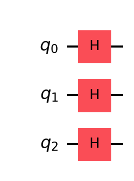
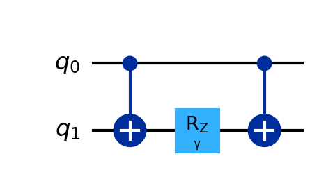
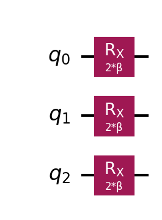
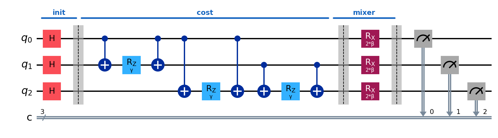

# Deep-Dive 1: Building QAOA from Gates

_This chapter teaches the QAOA algorithm at the circuit level; how every piece becomes concrete operations on qubits. It pairs with Chapter 1 (Logistics), which introduced the problem and the algorithm conceptually._

## In This Chapter

- **What you'll learn:** How to encode a MaxCut problem as a quantum circuit, what each gate does and why, and how the classical optimiser tunes the quantum exploration.
- **What you need:** No prior quantum knowledge. This is the first deep dive; we introduce qubits, gates, superposition, and entanglement here, in context, because the algorithm needs them.
- **Runnable version:** The companion notebook [`01-logistics.ipynb`](../notebooks/01-logistics.ipynb) runs the same circuit on a cloud Quokka.

### Where we are and what we need

We have a cost function; the MaxCut objective; and we've learned that QAOA encodes it as a quantum operator (the cost Hamiltonian $C$), applies two alternating unitaries ($e^{-i\gamma C}$ and the mixer $e^{-i\beta B}$), and measures. What we haven't explained is how any of this becomes an actual quantum circuit; specific gates applied to specific qubits in a specific order.

Let's fix that. We'll build the entire circuit for MaxCut on a triangle (3 nodes, 3 edges), gate by gate, explaining *why* each gate is needed and *what it does* to the quantum state. By the end, you'll be able to construct QAOA circuits for any graph.

### Binary decisions become qubits

The first step is representation. In MaxCut, each node is coloured red or blue; a binary decision. Each binary decision becomes one qubit:

| Node | Qubit | $\lvert 0\rangle$ meaning | $\lvert 1\rangle$ meaning |
|:---|:---|:---|:---|
| 0 | `q[0]` | Red | Blue |
| 1 | `q[1]` | Red | Blue |
| 2 | `q[2]` | Red | Blue |

A specific colouring; say, node 0 is blue, nodes 1 and 2 are red; corresponds to the quantum state $\lvert 100\rangle$. The set of *all possible colourings* is the set of all 3-qubit computational basis states: $\lvert 000\rangle, \lvert 001\rangle, \ldots, \lvert 111\rangle$. There are $2^3 = 8$ of them.

So far, nothing quantum. A classical computer could do the same: 3 bits, 8 combinations. The quantum part starts when we put the qubits in superposition.

### Creating the starting state

QAOA begins by creating an *equal superposition* of all possible colourings. We want:

$$\lvert s \rangle = \frac{1}{\sqrt{8}}(\lvert 000\rangle + \lvert 001\rangle + \lvert 010\rangle + \lvert 011\rangle + \lvert 100\rangle + \lvert 101\rangle + \lvert 110\rangle + \lvert 111\rangle)$$

Every colouring has the same amplitude ($1/\sqrt{8}$), so every colouring has the same probability ($1/8$) of being measured. We're starting from complete ignorance; no colouring is preferred.

How do you create this state? With the **Hadamard gate** ($H$), applied to each qubit independently:

$$H\lvert 0\rangle = \frac{1}{\sqrt{2}}(\lvert 0\rangle + \lvert 1\rangle)$$

Apply $H$ to qubit 0, then qubit 1, then qubit 2. Because the qubits are independent at this point, the combined state is the tensor product:

$$H\lvert 0\rangle \otimes H\lvert 0\rangle \otimes H\lvert 0\rangle = \frac{1}{\sqrt{8}} \sum_{x \in \{0,1\}^3} \lvert x\rangle$$

In circuit form:

Three gates. That's all it takes to create a uniform superposition of 8 colourings. For $n$ qubits, it's $n$ Hadamard gates and $2^n$ terms in superposition. The exponential scaling is free; this is one of the few things quantum computers do that is genuinely magical.

> **Common Mistake #1:** Students sometimes say "the quantum computer is trying all 8 colourings at once." This is misleading. All 8 colourings are *present* in the superposition, but you can only *read out* one of them (the one you measure). The power of QAOA is not parallel evaluation; it's *interference*: manipulating the amplitudes so that good colourings become more likely to be measured.

### The problem unitary: turning edge costs into phases

Now we need to "imprint" the cost function onto the quantum state. We want colourings that cut many edges to acquire different phases from colourings that cut few edges. Later, the mixer will cause these phases to interfere, amplifying the good solutions.

The cost Hamiltonian for our triangle is:

$$C = \frac{1 - Z_0 Z_1}{2} + \frac{1 - Z_0 Z_2}{2} + \frac{1 - Z_1 Z_2}{2}$$

Each term contributes 1 when the edge is cut (qubits differ) and 0 when it's not (qubits agree). The total is the number of cut edges.

The *problem unitary* is $e^{-i\gamma C}$. What does this do? For each computational basis state $\lvert x \rangle$:

$$e^{-i\gamma C}\lvert x \rangle = e^{-i\gamma \cdot \text{cut}(x)}\lvert x \rangle$$

It multiplies each colouring by a phase that depends on how many edges it cuts. The colouring itself doesn't change; only its phase. Colourings with cut value 2 (the optimum for the triangle) get phase $e^{-2i\gamma}$. Colourings with cut value 0 get phase $e^0 = 1$. Different phases, same probabilities (for now).

But how do we *implement* $e^{-i\gamma C}$ as gates? Since the three edge terms in $C$ all commute with each other (they're all diagonal in the computational basis), we can apply them separately:

$$e^{-i\gamma C} = e^{-i\gamma(1 - Z_0 Z_1)/2} \cdot e^{-i\gamma(1 - Z_0 Z_2)/2} \cdot e^{-i\gamma(1 - Z_1 Z_2)/2}$$

Each factor handles one edge. Let's focus on the first edge, $(0, 1)$.

### The ZZ gate: one edge at a time

We need to implement $e^{-i\gamma(1 - Z_0 Z_1)/2}$. The constant part $e^{-i\gamma/2}$ is just a global phase (it multiplies every state equally), so we can ignore it; global phases are unobservable. What remains is $e^{i\gamma Z_0 Z_1 / 2}$.

Now, $Z_0 Z_1$ is diagonal in the computational basis. Its eigenvalues are:

| $q_0$ | $q_1$ | $Z_0$ | $Z_1$ | $Z_0 Z_1$ | Meaning |
|:---:|:---:|:---:|:---:|:---:|:---|
| 0 | 0 | +1 | +1 | +1 | Same colour; edge not cut |
| 0 | 1 | +1 | −1 | −1 | Different colours; edge cut |
| 1 | 0 | −1 | +1 | −1 | Different colours; edge cut |
| 1 | 1 | −1 | −1 | +1 | Same colour; edge not cut |

So $e^{i\gamma Z_0 Z_1 / 2}$ applies phase $e^{i\gamma/2}$ when the qubits agree and $e^{-i\gamma/2}$ when they disagree.

How do we build this from standard gates? The trick is the **CNOT sandwich**:

Here's what happens step by step:

1. **First CNOT** (`cx q[0], q[1]`): XORs qubit 1 with qubit 0. Now qubit 1 holds the *parity* of the two original bits: it's $\lvert 0\rangle$ if they were equal, $\lvert 1\rangle$ if they were different.

2. **$R_Z(\gamma)$ on qubit 1** (`rz(γ) q[1]`): applies phase $e^{-i\gamma/2}$ if qubit 1 is $\lvert 1\rangle$ (qubits were different = edge cut), and $e^{i\gamma/2}$ if qubit 1 is $\lvert 0\rangle$ (qubits were same = edge not cut). This is exactly the phase we want.

3. **Second CNOT** (`cx q[0], q[1]`): undoes the XOR, restoring qubit 1 to its original value.

Net effect: the computational basis states are unchanged, but each one picks up a phase that depends on whether the two qubits agree or disagree. That's $e^{i\gamma Z_0 Z_1 / 2}$.

For edge $(0, 1)$, this is the same CNOT sandwich shown above. Repeat for edges $(0, 2)$ and $(1, 2)$, and you've implemented the full problem unitary.

> **Why does this work?** The CNOT "extracts" the parity into a single qubit, the $R_Z$ "acts" on that parity, and the second CNOT "puts it back." This is a general trick: whenever you need a gate that depends on the *relationship* between two qubits (same? different?), you can use a CNOT to compute that relationship, act on it, and undo the CNOT.

### The mixer: exploring the neighbourhood

After the problem unitary, the quantum state has different phases for different colourings, but the probabilities are still all equal ($1/8$ each). We need the mixer to convert phase differences into probability differences.

The mixer Hamiltonian is $B = X_0 + X_1 + X_2$, and the mixer unitary is $e^{-i\beta B}$. Since X operators on different qubits commute, this factorises:

$$e^{-i\beta B} = e^{-i\beta X_0} \cdot e^{-i\beta X_1} \cdot e^{-i\beta X_2}$$

Each factor is just an $R_X$ rotation: $e^{-i\beta X} = R_X(2\beta)$:

What does $R_X(\theta)$ do? It rotates the qubit's state around the X axis of the Bloch sphere. In the computational basis, it mixes $\lvert 0\rangle$ and $\lvert 1\rangle$:

$$R_X(\theta)\lvert 0\rangle = \cos(\theta/2)\lvert 0\rangle - i\sin(\theta/2)\lvert 1\rangle$$

At $\beta = 0$, the mixer does nothing ($R_X(0) = I$). At $\beta = \pi/2$, it flips every qubit ($R_X(\pi) = -iX$). In between, it partially "mixes"; allowing amplitude to flow between colourings that differ by one bit flip.

This is the quantum analogue of the "flip one node" move in classical local search. But crucially, the mixing is *coherent*: it preserves the phase relationships that the problem unitary created. The phases *interfere* during mixing; colourings with low cost (large negative phase) tend to accumulate amplitude, while colourings with high cost tend to lose it.

### The full circuit, assembled

Putting it all together for the triangle, at depth $p = 1$:

Gate count: 3 Hadamards + 6 CNOTs + 3 $R_Z$ + 3 $R_X$ + 3 measurements = **18 gates**, of which 6 are the expensive ones (CNOTs). For a general graph with $n$ nodes and $m$ edges at depth $p$: $n + p(2m \text{ CNOTs} + m \text{ }R_Z + n \text{ }R_X)$ gates.

### Choosing $\gamma$ and $\beta$: the classical outer loop

The quantum circuit takes two numbers: $\gamma$ and $\beta$; and produces measurement samples. But which values of $\gamma$ and $\beta$ make the good colourings most likely?

This is a classical optimisation problem. You run the circuit many times (say, 1,000 shots), compute the average cut value from the measurements, and feed this to a classical optimiser that suggests better $\gamma$ and $\beta$. Repeat until the average cut value stops improving.

The optimisation landscape; average cut value as a function of $(\gamma, \beta)$; is smooth and periodic for small graphs. For the triangle, the optimum is near $\gamma \approx \pi/4$, $\beta \approx \pi/8$. The companion notebook sweeps the full landscape and visualises it as a heatmap.

> **Common Mistake #2:** "QAOA finds the optimal solution by exploration." Not quite. A single run of the QAOA circuit produces a *probability distribution* over colourings; not a single guaranteed answer. You sample from this distribution. The optimisation loop adjusts $\gamma$ and $\beta$ to shift the distribution toward better colourings. The algorithm is probabilistic: you run it many times and take the best sample.

### Going deeper: depth $p > 1$

Everything above is depth-1 QAOA. At depth $p$, you repeat the problem unitary and mixer $p$ times, with independent parameters $\gamma_1, \beta_1, \gamma_2, \beta_2, \ldots, \gamma_p, \beta_p$:

$$\lvert \vec{\gamma}, \vec{\beta} \rangle = \prod_{k=1}^{p} e^{-i\beta_k B} e^{-i\gamma_k C} \lvert + \rangle^n$$

More depth means more expressive circuits; the algorithm can create more complex interference patterns, potentially finding better solutions. But it also means more parameters to optimise ($2p$ in total), deeper circuits (more gates = more noise on real hardware), and a harder classical optimisation problem.

In the limit $p \to \infty$, QAOA can produce *any* quantum state and find the exact optimum. In practice, $p = 1$ to $p = 20$ are the interesting range. The exact performance of QAOA at each depth; which determines whether it's competitive with classical algorithms; is what the tree tensor network methods described in the Reality Check compute.

### What you should take away

1. **Every classical binary decision becomes a qubit.** The encoding is direct: 0/1 → $\lvert 0\rangle / \lvert 1\rangle$.
2. **The cost function becomes a phase operator.** The CNOT sandwich trick turns pairwise cost terms ($Z_i Z_j$) into phases on the quantum state.
3. **The mixer creates interference.** $R_X$ rotations allow amplitude to flow between colourings, with phases from the problem unitary causing constructive interference on good solutions.
4. **The classical optimiser tunes the circuit.** $\gamma$ controls how strongly the cost function influences the state; $\beta$ controls how much mixing occurs.
5. **The circuit is small.** A depth-1 QAOA for $n$ nodes and $m$ edges uses $2m$ CNOTs. This is feasible on current quantum hardware for small-to-moderate graphs.

