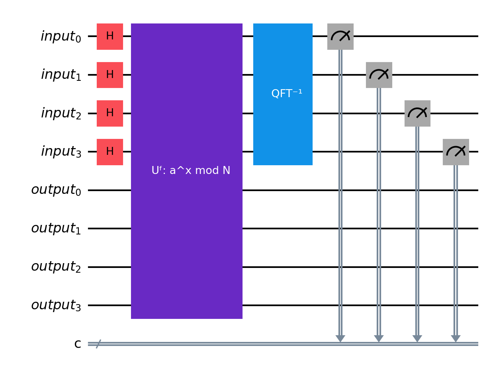

# Unit 2: Cryptography — *The Trapdoor Quantum Computers Can Kick Open*

## The Hook

Every time you type a credit card number into a website, a quiet miracle happens. Your browser and the server agree on a secret key; a number that only the two of them know; even though they've never met before, and even though everything they say to each other travels across a network that anyone can eavesdrop on.

This is **public-key cryptography**, and it protects virtually every financial transaction, every encrypted email, every software update, and every government communication on Earth. The entire system rests on a single mathematical assumption:

**Multiplying two large prime numbers is easy. Factoring their product is hard.**

Take two 1,000-digit primes $p$ and $q$. Multiplying them takes microseconds. The product $N = p \times q$ is a 2,000-digit number. Now hand someone $N$ and ask them to find $p$ and $q$. The best classical algorithms would take longer than the age of the universe.

This asymmetry; easy to combine, hard to separate; is a **trapdoor**. RSA encryption, invented in 1977 and still the backbone of internet security, is built on exactly this trapdoor. If you know $p$ and $q$, you can decrypt messages quickly. If you only know $N$, you can't.

For nearly 50 years, this trapdoor has held. Classical computers have gotten faster, and classical factoring algorithms have improved (the General Number Field Sieve, circa 1993, is the current champion). But the best classical algorithms are still *sub-exponential*; they scale as roughly $e^{n^{1/3}}$ where $n$ is the number of digits. For 2,000-digit numbers, that's far beyond any conceivable classical computer.

In 1994, Peter Shor shattered this assumption.

Shor showed that a quantum computer can factor $N$ in time *polynomial* in the number of digits; roughly $n^3$. Not sub-exponential. Not "somewhat faster." Polynomial. For a 2,000-digit number, the difference is between $10^{30}$ years and a few hours.

Shor's algorithm doesn't just threaten RSA. His 1994 paper actually contains *two* quantum algorithms: one for **factoring** (which breaks RSA) and one for the **discrete logarithm problem** — given $g^x \bmod p = y$, find $x$ — which breaks Diffie-Hellman (the original public-key protocol) and **elliptic curve cryptography** (ECC), a modern alternative to RSA based on different mathematics. ECC was adopted precisely because its keys are shorter than RSA's for equivalent classical security, but it's in some ways *more* vulnerable: breaking a 256-bit elliptic curve key (P-256, comparable security to RSA-2048) requires only ~2,330 logical qubits, far fewer than the ~6,000 logical qubits needed for RSA-2048. (We'll define logical vs. physical qubits in the Reality Check.) Both algorithms use the same quantum ingredients: superposition, the QFT, and period-finding.

Let's understand why; and how.

## The Bottleneck

Why is factoring hard? It's not enough to say "the search space is big." The search space for sorting a list is big too, but sorting is easy. What makes factoring different is that we don't know how to *structure* the search.

### The trapdoor in detail

RSA works like this:

1. Alice picks two large primes $p$ and $q$ and computes $N = pq$
2. She publishes $N$ (her public key) and keeps $p, q$ secret (her private key)
3. Bob encrypts a message using $N$; a fast operation
4. Only Alice, who knows $p$ and $q$, can decrypt it; because decryption requires a key derived from $(p-1)(q-1)$ — the count of integers less than $N$ that share no factor with $N$

The security assumption: given $N$, nobody can find $p$ and $q$ efficiently. If they could, they could compute $(p-1)(q-1)$, derive the decryption key, and read everything.

### Why classical algorithms struggle

The naive approach; try dividing $N$ by every number up to $\sqrt{N}$; takes $O(\sqrt{N})$ time. For a 2,000-digit $N$, that's $10^{1000}$ operations. Hopeless.

The best classical algorithm, the General Number Field Sieve (GNFS), is far cleverer. It exploits algebraic number theory to find special relationships between numbers modulo $N$. Its running time is roughly:

$$\exp\!\left(1.923 \, (\ln N)^{1/3} \, (\ln \ln N)^{2/3}\right)$$

where $n$ is the number of bits in $N$ (equivalently, $n = \log_2 N$). This is *sub-exponential* — faster than brute force, but still far slower than polynomial. For RSA-2048 (a 617-digit number), the estimated classical effort is around $2^{112}$ operations; securely beyond reach for the foreseeable future.

The fundamental issue: factoring has no known *polynomial-time* classical algorithm. There's no proof that one doesn't exist (factoring is not known to be NP-complete — meaning it hasn't been proven to be among the "hardest of the hard" problems), but decades of effort by the world's best mathematicians and computer scientists have failed to find one.

### Factoring reduces to period-finding

Here's the insight that opens the door to quantum computation. Factoring $N$ reduces to finding the **period** of a function.

Pick a random number $a < N$. Define the function:

$$f(x) = a^x \bmod N$$

The notation $\bmod N$ means "take the remainder after dividing by $N$." So $7^2 \bmod 15 = 49 \bmod 15 = 4$, because 49 divided by 15 leaves remainder 4.

This function is periodic. There exists some integer $r$ (called the **order** of $a$ modulo $N$) such that $a^r \bmod N = 1$, and therefore $f(x + r) = f(x)$ for all $x$. The notation $a^r \equiv 1 \pmod{N}$ says the same thing: $a^r$ and $1$ have the same remainder when divided by $N$.

If you can find $r$, you can (with high probability) factor $N$. The algebraic trick:

$$a^r - 1 \equiv 0 \pmod{N}$$
$$(a^{r/2} - 1)(a^{r/2} + 1) \equiv 0 \pmod{N}$$

If $r$ is even and $a^{r/2} \not\equiv -1 \pmod{N}$, then the **greatest common divisor** $\gcd(a^{r/2} - 1, N)$ — the largest number that divides both arguments — gives a non-trivial factor of $N$.

So: **if you can find periods efficiently, you can factor efficiently.** Classically, finding the period of $f(x) = a^x \bmod N$ is at least as hard as factoring. Quantumly, it's not.

## The Quantum Angle

Shor's algorithm finds the period $r$ of $f(x) = a^x \bmod N$ using three quantum ingredients, each introduced here for the first time:

1. **Superposition**; query $f$ on all inputs simultaneously
2. **The Quantum Fourier Transform**; extract the period from the phase pattern
3. **Interference**; amplify the right answer, suppress the wrong ones

### Superposition: querying all inputs at once

In Unit 1, we saw that qubits can be in superposition. Here we use it for something specific: *evaluating a function on all inputs in parallel*.

Start with two quantum **registers** — groups of qubits that together represent a single number, like how multiple bits form a byte in a classical computer. We need an **input register** of $n$ qubits (to hold $x$) and an **output register** large enough to hold $f(x)$. Initialise both to $|0\rangle$.

Apply Hadamard gates to every qubit in the input register. The notation $H^{\otimes n}$ is shorthand for "apply $H$ to each of the $n$ qubits":

$$|0\rangle^n \xrightarrow{H^{\otimes n}} \frac{1}{\sqrt{2^n}} \sum_{x=0}^{2^n - 1} |x\rangle$$

This creates an *equal superposition* of all $2^n$ possible inputs. Now apply the unitary that computes $f$:

$$\frac{1}{\sqrt{2^n}} \sum_{x} |x\rangle|0\rangle \xrightarrow{U_f} \frac{1}{\sqrt{2^n}} \sum_{x} |x\rangle|f(x)\rangle$$

With one application of $U_f$, we've "evaluated" $f$ on all $2^n$ inputs. The catch: if we measure, we get one random $(x, f(x))$ pair. We haven't gained anything yet. The power comes from what we do *before* measuring.

### The Quantum Fourier Transform: extracting periodicity

The function $f(x) = a^x \bmod N$ is periodic with period $r$. This means the amplitudes in our quantum state have a hidden structure: for each value $y$ in the output register, the input values $x$ that map to $y$ are evenly spaced with spacing $r$.

We need to extract $r$ without knowing which $y$ we'll observe. The tool for this is the **Quantum Fourier Transform** (QFT); the quantum analogue of the discrete Fourier transform.

The classical DFT converts a signal from the time domain to the frequency domain. A periodic signal with period $r$ has a frequency peak at $1/r$. The QFT does the same thing to quantum amplitudes.

Applied to the input register, the QFT maps:

$$|x\rangle \xrightarrow{\text{QFT}} \frac{1}{\sqrt{2^n}} \sum_{k=0}^{2^n-1} e^{2\pi i xk / 2^n} |k\rangle$$

The key property: if the input amplitudes are periodic with period $r$, then after the QFT, the amplitudes are concentrated on values of $k$ that are close to multiples of $2^n / r$. Measuring $k$ and computing $k / 2^n$ gives an approximation to $j/r$ for some integer $j$. A few measurements and some classical post-processing (the continued fractions algorithm) recover $r$ exactly.

### Phase kickback: why the QFT "sees" the period

Why does the QFT work here? The deep reason is **phase kickback**; the mechanism by which a function evaluation on a quantum computer imprints information as *phases* rather than as bit values.

When $f$ is computed in superposition, the output register becomes entangled with the input register. If we were to measure the output register and get some value $y_0$, the input register would collapse to an equal superposition of all $x$ values satisfying $f(x) = y_0$:

$$\frac{1}{\sqrt{M}} \sum_{j=0}^{M-1} |x_0 + jr\rangle$$

where $x_0$ is the smallest such $x$ and $M \approx 2^n/r$ is the number of terms (one for each multiple of $r$ that fits in the register). This state is periodic with period $r$; and the QFT converts periodicity in position to peaks in frequency.

We don't actually need to measure the output register. The entanglement does the work for us: the QFT on the input register "sees" the period regardless of which $y_0$ the output register would have yielded. This is the subtlety that makes quantum period-finding work.

### Interference: why the wrong answers cancel

The QFT isn't magic; it's interference. Each output state $|k\rangle$ receives contributions from all input states $|x\rangle$, weighted by the complex phase $e^{2\pi i xk / 2^n}$. When $k$ is a multiple of $2^n / r$, the phases from the $r$ equally-spaced inputs align; they add constructively. When $k$ is not a multiple of $2^n / r$, the phases point in different directions and cancel; destructive interference.

This is the same physics that creates light and dark bands when light passes through narrow slits: waves that arrive in sync reinforce each other (bright band), waves that arrive out of sync cancel (dark band). The QFT is like a multi-slit experiment with $2^n$ slits, and the period $r$ determines which bands are bright.

### Putting it together

Here is Shor's algorithm as a circuit, drawn at the same box level we used for QAOA in Unit 1:

Two registers. The top four wires are the input register; the bottom four are the output register. Read left to right: Hadamard creates superposition, the oracle $U_f$ evaluates $a^x \bmod N$ in superposition, the inverse QFT extracts the period, and measurement reads out a frequency. Only the input register is measured.

Shor's algorithm:

1. Pick a random $a < N$, check $\gcd(a, N) = 1$
2. Prepare a superposition of all inputs: $\frac{1}{\sqrt{2^n}} \sum_x |x\rangle|0\rangle$
3. Compute $f(x) = a^x \bmod N$ in superposition
4. Apply the QFT to the input register
5. Measure the input register → get $k \approx j \cdot 2^n / r$
6. Use the **continued fractions algorithm** — a classical method that finds the simplest fraction $j/r$ close to $k / 2^n$ — to extract $r$
7. Compute $\gcd(a^{r/2} \pm 1, N)$ → factors of $N$

Steps 1, 6, and 7 are classical. Steps 2–5 are quantum. The quantum part runs in $O(n^2 \log n)$ gates; polynomial in the number of digits.

## Worked Example

Let's factor $N = 15$ using Shor's algorithm.

### Step 1: Pick $a$

Choose $a = 7$. Check: $\gcd(7, 15) = 1$. Good.

### Step 2–3: Compute $7^x \bmod 15$ in superposition

The values cycle:

| $x$ | $7^x \bmod 15$ |
|-----|----------------|
| 0 | 1 |
| 1 | 7 |
| 2 | 4 |
| 3 | 13 |
| 4 | 1 |
| 5 | 7 |
| 6 | 4 |
| 7 | 13 |

The period is $r = 4$.

### Step 4–5: QFT and measurement

Using 4 qubits for the input register ($2^4 = 16$), the QFT concentrates amplitude on multiples of $16/4 = 4$. The possible measurement outcomes are $k \in \{0, 4, 8, 12\}$, each with probability $1/4$.

| Measured $k$ | $k / 2^n = k / 16$ | Continued fractions → $r$ |
|-------------|--------------------|----|
| 0 | 0 | No information |
| 4 | 1/4 | $r = 4$ $\checkmark$ |
| 8 | 1/2 | $r = 2$ (try again) |
| 12 | 3/4 | $r = 4$ $\checkmark$ |

Two of the four outcomes directly return $r = 4$. The outcome $k = 8$ gives denominator 2 (a factor of $r$, not $r$ itself — we'd need to try again or check). The outcome $k = 0$ gives no information.

### Step 6–7: Extract factors

With $r = 4$:

$$7^{4/2} = 7^2 = 49$$
$$\gcd(49 - 1, 15) = \gcd(48, 15) = 3$$
$$\gcd(49 + 1, 15) = \gcd(50, 15) = 5$$

And indeed: $15 = 3 \times 5$. $\blacksquare$

This is a toy example; 4 qubits, a number you can factor in your head. But the algorithm scales polynomially. For RSA-2048 (a 617-digit, 2,048-bit number), Shor's algorithm requires roughly 6,000 logical qubits and $O(n^3)$ gates with $n = 2{,}048$. The same algorithm, larger registers, more gates, same polynomial efficiency.

→ *The next chapter builds the period-finding circuit from scratch, and the companion notebook shows the runnable compiled-toy version honestly.*

### Back to your browser

We started with credit card numbers and the quiet miracle of public-key cryptography. We factored $15 = 3 \times 5$ on a toy quantum computer. What connects the two?

Scale. The same algorithm that finds the period of $7^x \bmod 15$ can find the period of $a^x \bmod N$ for any $N$. For RSA-2048, $N$ is a 617-digit number, the algorithm needs ~6,000 logical qubits, and the circuit has $\sim 10^{10}$ gates. But the structure is identical: superposition, oracle, QFT, measure, continued fractions, $\gcd$. The quantum computer doesn't know whether it's breaking a classroom exercise or a government cipher. It just finds periods.

That's why the world's cryptographic infrastructure is being rebuilt. Not because a quantum computer has broken RSA — none has — but because the algorithm is ready and waiting. When the hardware catches up, it will work.

## Reality Check

Shor's algorithm is the most famous quantum algorithm, and its implications are enormous. But let's be precise about what has and hasn't been demonstrated.

**What's been factored quantumly.** The largest number factored by a genuine implementation of Shor's algorithm on a quantum computer is $21 = 3 \times 7$ (Martín-López et al., 2012, using photonic qubits). A separate experiment factored 15 using NMR (Vandersypen et al., 2001). Various claims of factoring larger numbers use compiled or problem-specific circuits that don't generalise; they exploit known structure of the answer, which defeats the purpose.

In short: Shor's algorithm has never been run, at scale, on a number whose factors were unknown.

**Resource estimates for RSA-2048.** To make these estimates concrete, two terms matter: a **physical qubit** is one imperfect qubit on real hardware, and a **logical qubit** is an error-corrected qubit built from many physical qubits — hundreds or thousands, depending on the error-correction scheme. Today's machines have physical qubits; Shor's algorithm at scale needs logical ones. A **fault-tolerant** quantum computer is one that uses error correction to run arbitrarily long computations reliably, despite individual gates being imperfect.

Gidney and Ekerå (2021) estimated that factoring a 2,048-bit RSA key would require approximately **20 million noisy physical qubits** (using the *surface code*, with a gate error rate of $10^{-3}$) and roughly **8 hours** of computation.

That estimate has dropped dramatically. The **Pinnacle architecture** (2026) uses *quantum LDPC codes* — a newer approach that packs more logical qubits per physical qubit — to reduce the cost to under **100,000 physical qubits**; a 200× improvement. The largest quantum computers in 2026 have a few thousand physical qubits, so we're still short; but 100K qubits is within plausible reach of hardware roadmaps in the next 5–10 years. The threat timeline just got much shorter.

On the elliptic curve side, new circuit designs (2026) reduce the estimated time to break P-256 — the most widely deployed curve, with security comparable to RSA-2048 — to minutes on a fault-tolerant machine.

**The post-quantum migration.** The threat is taken seriously. NIST finalised its first set of post-quantum cryptography standards in 2024: CRYSTALS-Kyber (key encapsulation) and CRYSTALS-Dilithium (digital signatures), both based on lattice problems believed to be hard for quantum computers. The U.S. government has mandated that federal systems begin migrating to post-quantum cryptography. Google, Cloudflare, and Apple have already deployed post-quantum key exchange in their products.

The migration timeline is measured in decades, not years. Cryptographic infrastructure is deeply embedded in hardware, software, and protocols. The risk is **harvest now, decrypt later**: an adversary records encrypted traffic today and decrypts it in 15 years when a quantum computer is available. For secrets that must remain confidential for decades (state secrets, medical records, financial data), the threat is already real.

**What's real today:** Shor's algorithm works. The mathematics is settled. The only question is when quantum hardware will be capable of running it at scale. The cryptography community has decided not to wait for the answer.

## Chef's Notes

- **Superposition, interference, and phase kickback.** These three concepts; introduced here for the first time; are the engine of essentially every quantum speedup. Superposition lets you process many inputs at once. Interference lets you amplify the right answers. Phase kickback is the mechanism that converts function evaluations into phases that interference can act on. When you encounter these concepts in later units, you've already met them here.

- **The QFT appears again in QPE** (Unit 7). Quantum Phase Estimation is essentially "Shor's period-finding subroutine applied to a unitary operator instead of modular exponentiation." If you understand why the QFT extracts periodicity, you understand QPE; and QPE is the most important subroutine in fault-tolerant quantum computing.

- **Shor's algorithm via amplitude estimation.** There's a structural connection to Unit 5 (Finance): Shor's period-finding can be viewed as a special case of quantum phase estimation, which is itself related to amplitude estimation. The algorithms look different on the surface but share the same core: extract a number encoded in the phase of a quantum state.

- **Why we don't start with Shor.** Most quantum computing textbooks open with Shor's algorithm because it's dramatic and historically important. We put it in Unit 2 (not Unit 1) because you need qubits and superposition from Unit 1 to understand it, and because the factoring problem; while economically critical; is less *relatable* than route optimisation. The UPS driver's $50M is visceral. RSA's factoring trapdoor requires setup to appreciate.

- **Further reading:**
    - Shor (1994). *Algorithms for Quantum Computation: Discrete Logarithms and Factoring.* [arXiv:quant-ph/9508027](https://arxiv.org/abs/quant-ph/9508027)
    - Gidney and Ekerå (2021). *How to factor 2048 bit RSA integers in 8 hours using 20 million noisy qubits.* [arXiv:1905.09749](https://arxiv.org/abs/1905.09749)
    - Webster, Berent, Chandra, Hockings et al. (2026). *The Pinnacle Architecture: Reducing the cost of breaking RSA-2048 to 100,000 physical qubits using quantum LDPC codes.* [arXiv:2602.11457](https://arxiv.org/abs/2602.11457)
    - Roetteler, Naehrig, Svore, Lauter (2017). *Quantum Resource Estimates for Computing Elliptic Curve Discrete Logarithms.* [arXiv:1706.06752](https://arxiv.org/abs/1706.06752)
    - Kim, Jang, Wang, Baksi, Song et al. (2026). *New Quantum Circuits for ECDLP: Breaking Prime Elliptic Curve Cryptography in Minutes.* [ePrint 2026/106](https://eprint.iacr.org/2026/106)
    - NIST (2024). *Post-Quantum Cryptography Standardization.* [csrc.nist.gov/projects/post-quantum-cryptography](https://csrc.nist.gov/projects/post-quantum-cryptography)
    - Vandersypen et al. (2001). *Experimental realization of Shor's quantum factoring algorithm using nuclear magnetic resonance.* [Nature 414:883–887](https://doi.org/10.1038/414883a) ([arXiv:quant-ph/0112176](https://arxiv.org/abs/quant-ph/0112176))
    - Nielsen and Chuang (2000). *Quantum Computation and Quantum Information.* Chapter 5: The quantum Fourier transform and its applications.
