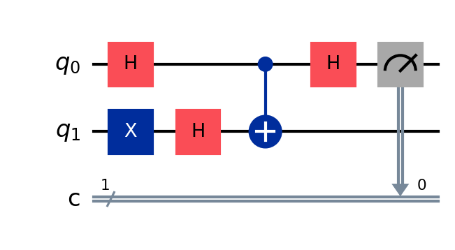
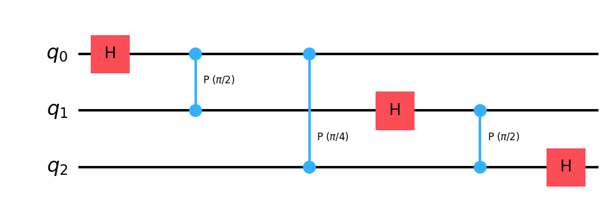
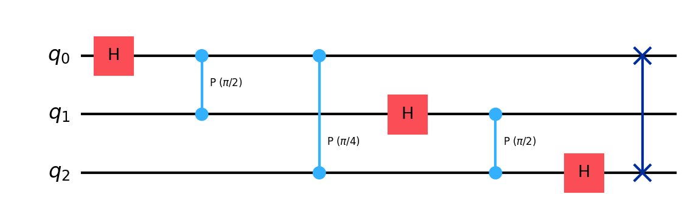

# Deep-Dive 2: Inside Shor's Algorithm

_This chapter pairs with Chapter 3 (Cryptography), which explained why factoring breaks RSA and how period-finding solves factoring. Here we build the period-finding circuit from scratch._

## In This Chapter

- **What you'll learn:** How to extract the period of a function using a quantum circuit; the Quantum Fourier Transform, phase kickback, oracles, and why interference makes it all work.
- **What you need:** From Chapter 2 (Building QAOA), you know what qubits are, how Hadamard creates superposition, and how CNOT entangles two qubits. We build everything else here.
- **Runnable version:** The companion notebook [`02-cryptography.ipynb`](../notebooks/02-cryptography.ipynb) factors 15 on a cloud Quokka.

## The problem we need to solve

Chapter 3 showed that factoring $N$ reduces to finding the period $r$ of the function $f(x) = a^x \bmod N$. We need a circuit that:

1. Evaluates $f$ on all possible inputs simultaneously (superposition)
2. Extracts the period $r$ from the results (without knowing which specific outputs appeared)

The first part is straightforward; we saw in Chapter 2 how Hadamard creates superposition. The second part is the hard part, and it requires a new tool: the **Quantum Fourier Transform**.

But before we get to the QFT, we need to understand the mechanism that makes quantum function evaluation useful. It's called **phase kickback**, and it's the most important trick in quantum computing.

## Phase kickback: the trick behind everything

### The setup

Imagine you have a function $f(x)$ that you can evaluate as a quantum operation. The standard way to implement $f$ on a quantum computer uses two registers:

- An **input register** holding $|x\rangle$
- An **output register** that gets $|f(x)\rangle$

The operation $U_f$ acts as: $U_f|x\rangle|0\rangle = |x\rangle|f(x)\rangle$. If the input is in superposition, $f$ gets evaluated on all inputs:

$$U_f \left(\frac{1}{\sqrt{N}}\sum_x |x\rangle\right)|0\rangle = \frac{1}{\sqrt{N}}\sum_x |x\rangle|f(x)\rangle$$

This looks powerful; we've evaluated $f$ on $N$ inputs with one operation. But there's a catch: if we measure, we get one random pair $(x, f(x))$. No speedup.

### The trick

Here's the key insight, and it's subtle. Instead of writing $f$'s output into the output register, we can arrange for $f$'s value to appear as a **phase** on the input register. The output register becomes a catalyst; it helps compute the phase but returns to its original state.

How? Prepare the output register in a special state. If $f(x)$ is a single bit (0 or 1), prepare the output register in $|{-}\rangle = \frac{1}{\sqrt{2}}(|0\rangle - |1\rangle)$. Now:

$$U_f|x\rangle|{-}\rangle = (-1)^{f(x)}|x\rangle|{-}\rangle$$

The output register doesn't change. The value $f(x)$ has been "kicked back" as a phase $(-1)^{f(x)}$ on the *input* register.

Why does this happen? Let's trace it carefully:

$$U_f|x\rangle|{-}\rangle = U_f|x\rangle \cdot \frac{1}{\sqrt{2}}(|0\rangle - |1\rangle)$$

$$= \frac{1}{\sqrt{2}}(U_f|x\rangle|0\rangle - U_f|x\rangle|1\rangle)$$

$$= \frac{1}{\sqrt{2}}(|x\rangle|f(x)\rangle - |x\rangle|1 \oplus f(x)\rangle)$$

If $f(x) = 0$: this is $\frac{1}{\sqrt{2}}(|x\rangle|0\rangle - |x\rangle|1\rangle) = |x\rangle|{-}\rangle$. Phase $= +1$.

If $f(x) = 1$: this is $\frac{1}{\sqrt{2}}(|x\rangle|1\rangle - |x\rangle|0\rangle) = -|x\rangle|{-}\rangle$. Phase $= -1$.

The output register returns to $|{-}\rangle$ in both cases. The information about $f(x)$ lives entirely in the phase. This is phase kickback.

> **Why this matters:** Phases are invisible if you measure immediately: $|+1|^2 = |-1|^2 = 1$. But phases *interfere*. If we apply the right transformation after the phase kickback, different phases will add constructively (amplifying some states) or destructively (suppressing others). This is how quantum algorithms extract information that's hidden in the phases.

### Phase kickback for general functions

Phase kickback isn't limited to single-bit functions. For the period-finding problem, $f(x) = a^x \bmod N$ produces multi-bit outputs. The mechanism is more general: instead of $(-1)^{f(x)}$, the phase encodes the *eigenvalue* of the oracle operator. We'll see this in detail when we build the full period-finding circuit below.

The pattern generalises beautifully. Deutsch-Jozsa, Bernstein-Vazirani, Simon's algorithm, Grover's search, and Shor's algorithm all use phase kickback. Master it once, and you've understood the engine of quantum speedup.

## Oracles: asking quantum questions

### What an oracle is

An **oracle** is a black box that computes a function $f$ reversibly. You don't know (or don't care) how it works internally; you only know what it computes. In circuit terms, an oracle is a unitary $U_f$ that encodes $f$ somehow.

In Chapter 2 (QAOA), we didn't use oracles; the cost function was built directly as a sum of $ZZ$ interactions. In period-finding, the function $f(x) = a^x \bmod N$ is the oracle. The quantum algorithm doesn't need to know *how* modular exponentiation is implemented; it just needs to call $U_f$ and exploit phase kickback.

### The Deutsch-Jozsa pattern

To see oracles and phase kickback in their simplest form, consider this problem: you're given a function $f:\{0,1\} \to \{0,1\}$, and you want to know if $f(0) = f(1)$ (constant) or $f(0) \neq f(1)$ (balanced). Classically: two queries. Quantumly: one.

The circuit:

1. Prepare $|0\rangle|{-}\rangle$ (ancilla in $|{-}\rangle$ via $X$ then $H$)
2. Apply $H$ to the input qubit → superposition $|{+}\rangle|{-}\rangle$
3. Apply the oracle → phase kickback: $\frac{1}{\sqrt{2}}((-1)^{f(0)}|0\rangle + (-1)^{f(1)}|1\rangle)|{-}\rangle$
4. Apply $H$ to the input qubit → interference
5. Measure

If $f$ is constant ($f(0) = f(1)$), both terms have the same phase, the Hadamard maps them back to $|0\rangle$, and you measure 0.

If $f$ is balanced ($f(0) \neq f(1)$), the terms have opposite phases, the Hadamard maps them to $|1\rangle$, and you measure 1.

One query. The phase kickback converted the function's output into a phase, and the Hadamard converted the phase difference into a measurable bit. This is the template for everything that follows.

### From one bit to $n$ bits

The Deutsch-Jozsa algorithm generalises: for $f:\{0,1\}^n \to \{0,1\}$ promised to be constant or balanced, one quantum query suffices (vs. $2^{n-1}+1$ classically). The circuit is the same: $H^{\otimes n}$, oracle, $H^{\otimes n}$, measure; and the mechanism is the same: phase kickback + Hadamard interference.

Bernstein-Vazirani extends this: the oracle encodes a hidden string $s$, and the same circuit recovers all $n$ bits of $s$ in one query. Simon's algorithm goes further: for a function with a hidden period $s$ (where $f(x) = f(x \oplus s)$), $O(n)$ queries suffice quantumly vs. $O(2^{n/2})$ classically. Each of these is a stepping stone toward Shor's algorithm; they all use phase kickback and Fourier-type interference, applied to increasingly structured problems.

## The Quantum Fourier Transform

### Why we need it

Shor's algorithm needs to extract the *period* of a function; not a single bit of information (constant vs. balanced) but a number $r$ that could be anywhere from 1 to $N$.

The Hadamard transform, which we used in Deutsch-Jozsa, is actually a 1-qubit Fourier transform. To extract a period from a multi-qubit state, we need the full **Quantum Fourier Transform**; the generalisation of the Hadamard to $n$ qubits.

### What the QFT does

The classical Discrete Fourier Transform converts a sequence of numbers from the "time domain" to the "frequency domain." A periodic signal with period $r$ has energy concentrated at frequency $1/r$.

The QFT does the same thing to quantum amplitudes:

$$\text{QFT}|x\rangle = \frac{1}{\sqrt{2^n}} \sum_{k=0}^{2^n-1} e^{2\pi i x k / 2^n} |k\rangle$$

If the input state is periodic; amplitudes concentrated on values equally spaced by $r$; then the output state is concentrated on multiples of $2^n/r$. Measuring the output gives a multiple of $2^n/r$, from which we can extract $r$.

### How the QFT is built

The remarkable thing about the QFT is that it *factorises*. The output state can be written as a tensor product of single-qubit states:

$$\text{QFT}|x\rangle = \bigotimes_{\ell=1}^{n} \frac{1}{\sqrt{2}} \left(|0\rangle + e^{2\pi i x / 2^\ell} |1\rangle\right)$$

Each qubit in the output depends on the input through a phase $e^{2\pi i x / 2^\ell}$. This factorisation means the QFT can be built from:

- **Hadamard gates** (creating the $\frac{1}{\sqrt{2}}(|0\rangle + e^{i\phi}|1\rangle)$ superpositions)
- **Controlled phase gates** $R_k$ (adding the phase contributions from other qubits)

For 3 qubits, the circuit is:

where $R_k$ applies a controlled phase of $e^{2\pi i / 2^k}$. The QASM implementation (with bit-reversal swap) looks like:

Gate count: $n$ Hadamards + $n(n-1)/2$ controlled rotations = $O(n^2)$ gates. Compare with the classical FFT: $O(n \cdot 2^n)$ operations. The QFT is exponentially faster; but you can't read out the full Fourier transform (measurement collapses it to one value).

> **Common Mistake #1:** "The QFT gives an exponential speedup for Fourier transforms." Not exactly. The classical FFT transforms a vector of $2^n$ numbers and lets you read all of them. The QFT transforms $2^n$ amplitudes but only lets you *sample* one outcome. The speedup comes from the *combination* of QFT with specific problem structure (like periodicity), not from the QFT alone.

## Assembling Shor's algorithm

Now we have all the pieces. Let's put them together for factoring $N = 15$ with $a = 7$.

### Step 1: Superposition

Apply Hadamard to 4 input qubits:

$$|0000\rangle \xrightarrow{H^{\otimes 4}} \frac{1}{4}\sum_{x=0}^{15} |x\rangle$$

We've created a superposition of 16 input values. This is identical to what we did in Chapter 2 for QAOA; the Hadamard creates uniform superposition.

### Step 2: Oracle (modular exponentiation)

Compute $f(x) = 7^x \bmod 15$ in an output register. The state becomes:

$$\frac{1}{4}\sum_{x=0}^{15} |x\rangle|7^x \bmod 15\rangle$$

The output register creates entanglement between input values that produce the same output. Since $7^x \bmod 15$ has period 4, the inputs $\{0, 4, 8, 12\}$ all produce output 1, inputs $\{1, 5, 9, 13\}$ all produce output 7, etc.

### Step 3: Inverse QFT

Apply the inverse QFT to the input register. The periodic structure of the amplitudes (spacing = 4) becomes concentrated on frequency peaks (multiples of $16/4 = 4$).

### Step 4: Measure

We get one of $\{0, 4, 8, 12\}$ with equal probability.

### Step 5: Classical post-processing

From the measured value $k$ and the known register size $2^n = 16$:

$$k/16 \approx j/r$$

The **continued fractions algorithm** extracts $r$ from this rational approximation. For $k = 4$: $4/16 = 1/4$, so $r = 4$. For $k = 12$: $12/16 = 3/4$, and the continued fraction gives denominator 4, so $r = 4$ again.

### Step 6: Factor

$a^{r/2} = 7^2 = 49$. Compute $\gcd(49-1, 15) = \gcd(48, 15) = 3$ and $\gcd(49+1, 15) = \gcd(50, 15) = 5$.

$15 = 3 \times 5$. Done.

### The cost

For an $n$-bit number $N$: $O(n)$ qubits for the registers, $O(n^2)$ gates for the QFT, and $O(n^2 \log n)$ gates for the modular exponentiation (the expensive part). Total: **polynomial in $n$**; exponentially faster than the best classical factoring algorithm.

> **Common Mistake #2:** "Shor's algorithm finds factors by trying all possible factors simultaneously." No. It finds the *period* of a specific function, using the QFT to extract that period from a superposition. The period is then used *classically* (via $\gcd$) to find the factors. The quantum computer never "sees" the factors; it sees a frequency.

## The modular exponentiation circuit

The QFT is elegant and compact ($O(n^2)$ gates). The modular exponentiation; computing $a^x \bmod N$ reversibly; is where the circuit gets large.

### Repeated squaring

$a^x \bmod N$ is computed using the binary expansion of $x = x_{n-1} 2^{n-1} + \cdots + x_0$:

$$a^x = a^{x_0 \cdot 1} \cdot a^{x_1 \cdot 2} \cdot a^{x_2 \cdot 4} \cdots a^{x_{n-1} \cdot 2^{n-1}} \pmod{N}$$

Each factor is a **controlled multiplication**: if input bit $x_k = 1$, multiply the output register by $a^{2^k} \bmod N$; otherwise, do nothing. This is a controlled operation; controlled by qubit $k$ of the input register.

### Modular arithmetic on a quantum computer

Multiplication modulo $N$ is built from:

1. **Quantum adders** (Draper's QFT-based adder, Cuccaro's ripple-carry adder, or Gidney's optimised adder)
2. **Modular reduction** (subtract $N$ if the result exceeds $N$, using a comparison and controlled subtraction)
3. **Uncomputation** (reversibility requires undoing scratch computations to avoid creating garbage entanglement)

Each controlled multiplication costs $O(n^2)$ gates. There are $2n$ such multiplications (one per input qubit). Total: $O(n^3)$ gates for the naive version. Gidney and Ekerå (2021) brought this down to $O(n^2)$ Toffoli gates using windowed arithmetic.

For $N = 15$ (our toy example), the modular exponentiation is small enough to compile by hand. For RSA-2048, it's $\sim 10^{10}$ gates; feasible on a fault-tolerant machine, impossibly deep for NISQ.

## What you should take away

1. **Phase kickback** converts function values into phases. The output register is a catalyst; it enables the computation but returns to its starting state. The information lives in the phases of the input register.

2. **The QFT** converts periodicity in amplitudes to peaks in frequency. It's built from Hadamards and controlled rotations: $O(n^2)$ gates for $n$ qubits. It's the engine that extracts the period.

3. **Oracles** abstract away function computation. You don't need to know how $f$ is implemented; just that it can be called as a quantum operation. This separation of concerns is what makes quantum algorithms modular.

4. **The cost is dominated by the oracle.** The QFT is cheap ($O(n^2)$). The modular exponentiation is expensive ($O(n^2)$ to $O(n^3)$). For practical factoring, the modular arithmetic is where all the engineering effort goes.

5. **Shor's algorithm is not trying all factors.** It's using interference to extract a number-theoretic property (the period) that happens to reveal the factors. The quantum computer sees frequencies, not factors.

- **What you'll learn:** How Shor's algorithm works at the gate level; the QFT, modular exponentiation, continued fractions, and why period-finding breaks RSA.
- **What you need:** This chapter builds on Chapter 2 (QAOA deep dive), where we introduced qubits, superposition, and the CNOT gate. Here we add phase kickback, the Quantum Fourier Transform, and oracles; the machinery that makes Shor's algorithm tick.

*Coming soon. This chapter will follow the pedagogical model established in Chapter 2 (Building QAOA): start from the concepts the reader already has, build new ones organically, with concrete examples, common mistakes, and a complete working circuit by the end.*
