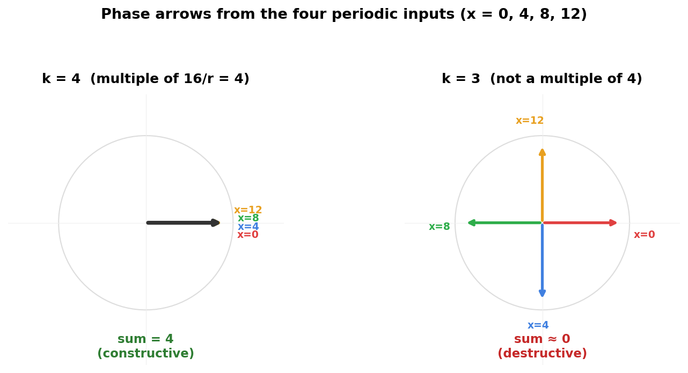

# Deep-Dive 2: Inside Shor's Algorithm

_This chapter pairs with Chapter 3 (Cryptography), which explained why factoring breaks RSA and how period-finding solves factoring. Here we build the period-finding circuit from scratch._

## In This Chapter

- **What you'll learn:** How to extract the period of a function using a quantum circuit; the Quantum Fourier Transform, phase kickback, oracles, and why interference makes it all work.
- **What you need:** From Chapter 2 (Building QAOA), you know what qubits are, how Hadamard creates superposition, and how CNOT entangles two qubits. We build everything else here.
- **Runnable version:** The companion notebook [`02-cryptography.ipynb`](../notebooks/02-cryptography.ipynb) factors 15 on a cloud Quokka.

## The problem we need to solve

Chapter 3 showed that factoring $N$ reduces to finding the period $r$ of the function $f(x) = a^x \bmod N$. We need a circuit that:

1. Evaluates $f$ on all possible inputs simultaneously (superposition)
2. Extracts the period $r$ from the results (without knowing which specific outputs appeared)

In Deep-Dive 1, we built QAOA from gates. The cost Hamiltonian imprinted phases on the quantum state — different colourings got different phases — and then the mixer caused interference that amplified good solutions. Shor's algorithm has exactly the same shape: a function imprints phases, and interference (via the QFT) extracts the answer. The details are different, but the architecture is the same.

Let's build it up, starting from things you already know.

## From CNOT to function evaluation

### A function you already know

In Deep-Dive 1, we used CNOT to compute the *parity* of two qubits as part of the ZZ gate. But CNOT does something simpler and more fundamental than we appreciated at the time: it computes **XOR**.

Here's the full truth table for CNOT, acting on an input qubit and an output qubit:

| Input $|x\rangle$ | Output before | Output after | What happened |
|:---:|:---:|:---:|:---|
| $|0\rangle$ | $|0\rangle$ | $|0\rangle$ | $0 \oplus 0 = 0$ |
| $|0\rangle$ | $|1\rangle$ | $|1\rangle$ | $1 \oplus 0 = 1$ |
| $|1\rangle$ | $|0\rangle$ | $|1\rangle$ | $0 \oplus 1 = 1$ |
| $|1\rangle$ | $|1\rangle$ | $|0\rangle$ | $1 \oplus 1 = 0$ |

The input qubit is never changed. The output qubit gets XOR'd with the input: $|b\rangle \to |b \oplus x\rangle$. That $\oplus$ is just "add, then take the remainder modulo 2" — the same as flipping the output when the input is 1, which is exactly what CNOT does.

When the output starts at $|0\rangle$, the XOR simply copies: $|0 \oplus x\rangle = |x\rangle$. So CNOT computes $f(x) = x$ (the identity function):

$$\text{CNOT}|x\rangle|0\rangle = |x\rangle|x\rangle = |x\rangle|f(x)\rangle$$

The input qubit is unchanged. The output qubit holds $f(x)$.

This is the pattern for *all* quantum function evaluation: you have an input register holding $|x\rangle$, an output register initialised to $|0\rangle$, and a circuit $U_f$ that XORs $f(x)$ into the output:

$$U_f|x\rangle|0\rangle = |x\rangle|0 \oplus f(x)\rangle = |x\rangle|f(x)\rangle$$

Why XOR and not just "write $f(x)$"? Because quantum operations must be *reversible* — you need to be able to undo them. Overwriting a register isn't reversible (the old value is lost). XOR is: apply $U_f$ twice and you get $|b \oplus f(x) \oplus f(x)\rangle = |b\rangle$, back to where you started. A single CNOT is the simplest oracle. Larger oracles — like the one that computes $a^x \bmod N$ — are built from networks of CNOTs and Toffoli gates, but they all follow this same XOR-into-the-output pattern.

For the identity function, $U_f$ is a single CNOT. For $f(x) = a^x \bmod N$, $U_f$ is a much larger circuit (we'll see how it's built later in this chapter). But the interface is always the same: input in, function value XOR'd into the output, input unchanged.

### What happens in superposition

Now put the input in superposition. Apply Hadamard to the input qubit before the CNOT:

$$H|0\rangle \otimes |0\rangle = \frac{1}{\sqrt{2}}(|0\rangle + |1\rangle)|0\rangle$$

Then apply $U_f$ (the CNOT):

$$\frac{1}{\sqrt{2}}(|0\rangle|f(0)\rangle + |1\rangle|f(1)\rangle) = \frac{1}{\sqrt{2}}(|0\rangle|0\rangle + |1\rangle|1\rangle)$$

We've evaluated $f$ on both inputs with one operation. But if we measure, we get one random pair: either $(0, 0)$ or $(1, 1)$. No speedup. The information is there — both answers are in the superposition — but measurement destroys it.

This is the fundamental challenge: superposition lets you evaluate $f$ on all inputs at once, but measurement gives you only one answer. The trick is to extract *structural information* about $f$ (like its period) without looking at individual values. That trick is called **phase kickback**.

## Phase kickback: the trick behind everything

### The problem with reading the output

When we evaluate $f$ in superposition, the result sits in the output register as a computational basis state — a "classical" value that we could read out. But reading it gives us one random answer. We need a way to extract information about the *pattern* of all the answers at once.

In QAOA, we faced a similar problem. The cost Hamiltonian didn't write "this colouring cuts 3 edges" into a register. Instead, it imprinted the cost as a *phase* on the quantum state — invisible to measurement but available for interference. Can we do the same thing with function evaluation?

Yes. Here's how.

### The $|{-}\rangle$ trick

First, two useful shorthands. Applying a Hadamard to $|0\rangle$ gives $|{+}\rangle = \frac{1}{\sqrt{2}}(|0\rangle + |1\rangle)$ — equal superposition with a plus sign. Applying $X$ then $H$ to $|0\rangle$ gives $|{-}\rangle = \frac{1}{\sqrt{2}}(|0\rangle - |1\rangle)$ — equal superposition with a minus sign. The only difference between $|{+}\rangle$ and $|{-}\rangle$ is one sign. That sign is about to do all the work.

Instead of initialising the output register to $|0\rangle$, initialise it to $|{-}\rangle$. Now watch what happens when we apply $U_f$ (for a single-bit function $f$):

$$U_f|x\rangle|{-}\rangle = (-1)^{f(x)}|x\rangle|{-}\rangle$$

The output register doesn't change — it comes back as $|{-}\rangle$ every time. But the *input register* picks up a phase of $(-1)^{f(x)}$: a plus sign when $f(x) = 0$, a minus sign when $f(x) = 1$. The function value has been "kicked back" from the output register into the phase of the input register.

### Why does this happen?

Let's trace it. We established that $U_f$ XORs $f(x)$ into the output: $U_f|x\rangle|b\rangle = |x\rangle|b \oplus f(x)\rangle$. Now expand $|{-}\rangle$ and apply $U_f$ to each term:

$$U_f|x\rangle|{-}\rangle = U_f|x\rangle \cdot \frac{1}{\sqrt{2}}(|0\rangle - |1\rangle)$$

$$= \frac{1}{\sqrt{2}}(|x\rangle|0 \oplus f(x)\rangle - |x\rangle|1 \oplus f(x)\rangle)$$

Here $\oplus$ means XOR (addition modulo 2): $0 \oplus 0 = 0$, $0 \oplus 1 = 1$, $1 \oplus 0 = 1$, $1 \oplus 1 = 0$.

**If $f(x) = 0$:** XOR with 0 changes nothing. We get $\frac{1}{\sqrt{2}}(|x\rangle|0\rangle - |x\rangle|1\rangle) = |x\rangle|{-}\rangle$. Phase $= +1$.

**If $f(x) = 1$:** XOR with 1 flips both bits. We get $\frac{1}{\sqrt{2}}(|x\rangle|1\rangle - |x\rangle|0\rangle) = -|x\rangle|{-}\rangle$. Phase $= -1$.

The output register returns to $|{-}\rangle$ in both cases — it's a catalyst, not a container. The information about $f(x)$ lives entirely in the phase of the input register. This is **phase kickback**.

> **Why this matters:** Phases are invisible if you measure immediately: $|+1|^2 = |-1|^2 = 1$. But phases *interfere*. If we apply the right transformation after the phase kickback, different phases will add constructively (amplifying some states) or destructively (suppressing others). This is how quantum algorithms extract information that's hidden in the phases. It's the same principle as QAOA — the cost phase was invisible until the mixer turned phase differences into probability differences.

### Phase kickback for general functions

Phase kickback isn't limited to single-bit functions. For the period-finding problem, $f(x) = a^x \bmod N$ produces multi-bit outputs. The mechanism is more general: instead of $(-1)^{f(x)}$, the phase encodes the *eigenvalue* of the oracle operator. (An eigenvalue is the factor by which an operator scales a particular state: if $U|v\rangle = \lambda|v\rangle$, then $\lambda$ is the eigenvalue and $|v\rangle$ is the eigenvector.) We'll see this in detail when we build the full period-finding circuit below.

The pattern generalises. Deutsch-Jozsa, Bernstein-Vazirani, Simon's algorithm, Grover's search, and Shor's algorithm all use phase kickback. Master it once, and you've understood the engine of quantum speedup.

## Oracles: packaging functions as gates

### What an oracle is

We've been calling the function-evaluating circuit $U_f$. In quantum computing, this is called an **oracle** — a black box that computes a function $f$ reversibly. You don't need to know how it works internally; you only need to know what it computes.

In Deep-Dive 1 (QAOA), we didn't use oracles — the cost function was built directly as a sum of ZZ interactions, gate by gate. In period-finding, the function $f(x) = a^x \bmod N$ is packaged as an oracle $U_f$. The quantum algorithm doesn't need to know *how* modular exponentiation is implemented; it just calls $U_f$ and exploits phase kickback.

### The Deutsch-Jozsa pattern

To see phase kickback in its simplest complete form, consider this problem: you're given a function $f:\{0,1\} \to \{0,1\}$ (meaning $f$ takes a single bit as input and returns a single bit), and you want to know if $f(0) = f(1)$ (constant) or $f(0) \neq f(1)$ (balanced). Classically: two queries. Quantumly: one.

The circuit:

1. Prepare $|0\rangle|{-}\rangle$ (the second qubit — called an **ancilla**, a helper qubit used as scratch space — is set to $|{-}\rangle$ via $X$ then $H$)
2. Apply $H$ to the input qubit → superposition $|{+}\rangle|{-}\rangle$
3. Apply the oracle → phase kickback: $\frac{1}{\sqrt{2}}((-1)^{f(0)}|0\rangle + (-1)^{f(1)}|1\rangle)|{-}\rangle$
4. Apply $H$ to the input qubit → interference
5. Measure

Step 4 is where interference happens, so let's slow down and watch it. After the oracle, the input qubit is in:

$$\frac{1}{\sqrt{2}}\bigl((-1)^{f(0)}|0\rangle + (-1)^{f(1)}|1\rangle\bigr)$$

Now recall what $H$ does to $|0\rangle$ and $|1\rangle$:

$$H|0\rangle = \frac{1}{\sqrt{2}}(|0\rangle + |1\rangle), \qquad H|1\rangle = \frac{1}{\sqrt{2}}(|0\rangle - |1\rangle)$$

Applying $H$ to our state, each term produces a contribution to $|0\rangle$ and to $|1\rangle$:

**If $f$ is constant** ($f(0) = f(1)$, so both phases are the same): the $|0\rangle$ contributions add up (both point the same way), while the $|1\rangle$ contributions cancel (one $+$, one $-$). Result: $|0\rangle$ with certainty. Constructive interference on $|0\rangle$, destructive on $|1\rangle$.

**If $f$ is balanced** ($f(0) \neq f(1)$, so the phases are opposite): now the $|0\rangle$ contributions cancel and the $|1\rangle$ contributions reinforce. Result: $|1\rangle$ with certainty.

This is interference in its purest form: two amplitudes arriving at the same state, either reinforcing or cancelling depending on their relative phase. The Hadamard is the "beam splitter" that makes them overlap so the phases can interact. Without it, the phases would sit on $|0\rangle$ and $|1\rangle$ separately, invisible to measurement. The Hadamard forces them to interfere — and the outcome tells you whether the phases were the same or different.

One query. The phase kickback converted the function's output into a phase, and the Hadamard converted the phase difference into a measurable bit. This is the template for everything that follows — and the QFT generalises this from "same or different?" to "what's the period?"

### From one bit to $n$ bits

The Deutsch-Jozsa algorithm generalises: for $f:\{0,1\}^n \to \{0,1\}$ (a function that takes an $n$-bit string and returns a single bit), promised to be constant or balanced, one quantum query suffices (vs. $2^{n-1}+1$ classically). The circuit is the same: $H^{\otimes n}$, oracle, $H^{\otimes n}$, measure; and the mechanism is the same: phase kickback + Hadamard interference.

Bernstein-Vazirani extends this: the oracle encodes a hidden string $s$, and the same circuit recovers all $n$ bits of $s$ in one query. Simon's algorithm goes further: for a function with a hidden period $s$ (where $f(x) = f(x \oplus s)$, with $\oplus$ meaning bitwise XOR), $O(n)$ queries suffice quantumly vs. $O(2^{n/2})$ classically. Each of these is a stepping stone toward Shor's algorithm — we won't detail them here, but they all use phase kickback and Fourier-type interference, applied to increasingly structured problems.

## The Quantum Fourier Transform

### Why we need it

Shor's algorithm needs to extract the *period* of a function; not a single bit of information (constant vs. balanced) but a number $r$ that could be anywhere from 1 to $N$.

The Hadamard transform, which we used in Deutsch-Jozsa, is actually a 1-qubit Fourier transform. To extract a period from a multi-qubit state, we need the full **Quantum Fourier Transform**; the generalisation of the Hadamard to $n$ qubits.

### What the QFT does

The classical Discrete Fourier Transform converts a sequence of numbers from the "time domain" to the "frequency domain." A periodic signal with period $r$ has energy concentrated at frequency $1/r$.

The QFT does the same thing to quantum amplitudes. The factor $e^{2\pi i \theta}$ is a complex number of magnitude 1 that encodes an angle $\theta$ — it's the mathematical language for phases:

$$\text{QFT}|x\rangle = \frac{1}{\sqrt{2^n}} \sum_{k=0}^{2^n-1} e^{2\pi i x k / 2^n} |k\rangle$$

If the input state is periodic; amplitudes concentrated on values equally spaced by $r$; then the output state is concentrated on multiples of $2^n/r$. Measuring the output gives a multiple of $2^n/r$, from which we can extract $r$.

### How the QFT is built

The remarkable thing about the QFT is that it *factorises*. The output state can be written as a tensor product of single-qubit states:

$$\text{QFT}|x\rangle = \bigotimes_{\ell=1}^{n} \frac{1}{\sqrt{2}} \left(|0\rangle + e^{2\pi i x / 2^\ell} |1\rangle\right)$$

Each qubit in the output depends on the input through a phase $e^{2\pi i x / 2^\ell}$. This factorisation means the QFT can be built from:

- **Hadamard gates** (creating the $\frac{1}{\sqrt{2}}(|0\rangle + e^{i\phi}|1\rangle)$ superpositions)
- **Controlled phase gates** $R_k$: a **controlled gate** applies an operation to one qubit only when another qubit is $|1\rangle$ — CNOT is a controlled-$X$; here $R_k$ is a controlled rotation that adds a phase of $e^{2\pi i / 2^k}$

For 3 qubits, the circuit is:

where $R_k$ applies a controlled phase of $e^{2\pi i / 2^k}$. The QFT naturally produces its output qubits in reverse order, so a final layer of SWAP gates puts them right:

Gate count: $n$ Hadamards + $n(n-1)/2$ controlled rotations = $O(n^2)$ gates. Compare with the classical Fast Fourier Transform (FFT): $O(n \cdot 2^n)$ operations. The QFT is exponentially faster; but you can't read out the full Fourier transform (measurement collapses it to one value).

> **Common Mistake #1:** "The QFT gives an exponential speedup for Fourier transforms." Not exactly. The classical FFT transforms a vector of $2^n$ numbers and lets you read all of them. The QFT transforms $2^n$ amplitudes but only lets you *sample* one outcome. The speedup comes from the *combination* of QFT with specific problem structure (like periodicity), not from the QFT alone.

### Why the QFT "sees" the period: phase arrows

The QFT works because of interference — the same mechanism we just watched in Deutsch-Jozsa, scaled up. In Deutsch-Jozsa, we had two amplitudes arriving at $|0\rangle$, either reinforcing or cancelling. In Shor's, we have *many* amplitudes arriving at each output $|k\rangle$, and the question is: do their phases line up?

Each output state $|k\rangle$ receives contributions from all the periodic input states, each carrying a phase $e^{2\pi i x k / 2^n}$. Think of each contribution as an arrow on the unit circle, pointing in the direction given by its phase. The total amplitude at $|k\rangle$ is the sum of all these arrows.

For our $N = 15$ example (period $r = 4$, register size $2^n = 16$), the four periodic inputs $x = 0, 4, 8, 12$ each contribute an arrow:

**Left ($k = 4$):** The four arrows point at $0°$, $0°$, $0°$, $0°$. Why? Because the phase for input $x$ is $e^{2\pi i \cdot x \cdot 4/16} = e^{2\pi i \cdot x/4}$, and when $x$ is a multiple of 4, the exponent is a whole number of turns around the circle — every arrow lands back at $0°$. They all add up: constructive interference. High probability.

**Right ($k = 3$):** The phase is $e^{2\pi i \cdot x \cdot 3/16}$. For $x = 0$: $0°$. For $x = 4$: $3/4$ of a full turn = $270°$. For $x = 8$: $3/2$ turns = $180°$. For $x = 12$: $9/4$ turns = $90°$. The arrows point in four different directions and cancel almost perfectly. Destructive interference. Near-zero probability.

The pattern: when $k$ is a multiple of $2^n/r = 4$, the periodicity of the inputs guarantees all arrows align. For any other $k$, the arrows spread around the circle and cancel. This is Deutsch-Jozsa's "same phase = reinforce, different phase = cancel" principle, but now applied across $r$ contributions at each of $2^n$ frequency bins. The QFT is the multi-frequency generalisation of the Hadamard beam splitter.

## Assembling Shor's algorithm

Now we have all the pieces. Let's put them together for factoring $N = 15$ with $a = 7$.

### Step 1: Superposition

Apply Hadamard to 4 input qubits:

$$|0000\rangle \xrightarrow{H^{\otimes 4}} \frac{1}{4}\sum_{x=0}^{15} |x\rangle$$

We've created a superposition of 16 input values. This is identical to what we did in Chapter 2 for QAOA; the Hadamard creates uniform superposition.

### Step 2: Oracle (modular exponentiation)

Compute $f(x) = 7^x \bmod 15$ in an output register. The state becomes:

$$\frac{1}{4}\sum_{x=0}^{15} |x\rangle|7^x \bmod 15\rangle$$

The output register creates entanglement between input values that produce the same output. Since $7^x \bmod 15$ has period 4, the inputs $\{0, 4, 8, 12\}$ all produce output 1, inputs $\{1, 5, 9, 13\}$ all produce output 7, etc.

### Step 3: Inverse QFT

Apply the **inverse QFT** to the input register. Since every quantum gate is reversible, we can run the QFT backwards to convert the periodic structure of the amplitudes (spacing = 4) into concentrated frequency peaks (multiples of $16/4 = 4$).

### Step 4: Measure

We get one of $\{0, 4, 8, 12\}$ with equal probability.

### Step 5: Classical post-processing

From the measured value $k$ and the known register size $2^n = 16$:

$$k/16 \approx j/r$$

The **continued fractions algorithm** extracts $r$ from this rational approximation. For $k = 4$: $4/16 = 1/4$, so $r = 4$. For $k = 12$: $12/16 = 3/4$, and the continued fraction gives denominator 4, so $r = 4$ again.

### Step 6: Factor

$a^{r/2} = 7^2 = 49$. Compute $\gcd(49-1, 15) = \gcd(48, 15) = 3$ and $\gcd(49+1, 15) = \gcd(50, 15) = 5$.

$15 = 3 \times 5$. Done.

### The cost

For an $n$-bit number $N$: $O(n)$ qubits for the registers, $O(n^2)$ gates for the QFT, and $O(n^2 \log n)$ gates for the modular exponentiation (the expensive part). Total: **polynomial in $n$**; exponentially faster than the best classical factoring algorithm.

The companion notebook runs this circuit end-to-end — factoring 15 on a cloud Quokka, stepping through the superposition, oracle, QFT, and classical post-processing.

→ **See [notebook `02-cryptography.ipynb`](../notebooks/02-cryptography.ipynb) for the runnable version.**

> **Common Mistake #2:** "Shor's algorithm finds factors by trying all possible factors simultaneously." No. It finds the *period* of a specific function, using the QFT to extract that period from a superposition. The period is then used *classically* (via $\gcd$) to find the factors. The quantum computer never "sees" the factors; it sees a frequency.

## The modular exponentiation circuit

The QFT is elegant and compact ($O(n^2)$ gates). The modular exponentiation; computing $a^x \bmod N$ reversibly; is where the circuit gets large.

### Repeated squaring

$a^x \bmod N$ is computed using the **binary expansion** of $x$. Any integer can be written as a sum of powers of 2: $x = x_{n-1} 2^{n-1} + \cdots + x_1 \cdot 2 + x_0$, where each $x_k$ is 0 or 1. This lets us decompose:

$$a^x = a^{x_0 \cdot 1} \cdot a^{x_1 \cdot 2} \cdot a^{x_2 \cdot 4} \cdots a^{x_{n-1} \cdot 2^{n-1}} \pmod{N}$$

We pre-compute $a^1, a^2, a^4, a^8, \ldots \pmod{N}$ by squaring at each step (hence "repeated squaring"), then multiply together only the terms where $x_k = 1$.

Each factor is a **controlled multiplication**: if input bit $x_k = 1$, multiply the output register by $a^{2^k} \bmod N$; otherwise, do nothing. This is a controlled operation; controlled by qubit $k$ of the input register.

### Modular arithmetic on a quantum computer

Multiplication modulo $N$ is built from:

1. **Quantum adders** (Draper's QFT-based adder, Cuccaro's ripple-carry adder, or Gidney's optimised adder)
2. **Modular reduction** (subtract $N$ if the result exceeds $N$, using a comparison and controlled subtraction)
3. **Uncomputation**: quantum operations must be reversible, so any scratch work must be run backwards after use. Leftover scratch qubits become entangled with the result — called *garbage entanglement* — which ruins interference.

Each controlled multiplication costs $O(n^2)$ gates. There are $2n$ such multiplications (one per input qubit). Total: $O(n^3)$ gates for the naive version. Gidney and Ekerå (2021) brought this down to $O(n^2)$ **Toffoli gates** — a Toffoli flips a target qubit only when *two* control qubits are both $|1\rangle$, making it the quantum AND gate.

For $N = 15$ (our toy example), the modular exponentiation is small enough to compile by hand. For RSA-2048, it's $\sim 10^{10}$ gates; feasible on a fault-tolerant machine, far too deep for today's noisy hardware (sometimes called NISQ — Noisy Intermediate-Scale Quantum).

## What you should take away

1. **Phase kickback** converts function values into phases. The output register is a catalyst; it enables the computation but returns to its starting state. The information lives in the phases of the input register.

2. **The QFT** converts periodicity in amplitudes to peaks in frequency. It's built from Hadamards and controlled rotations: $O(n^2)$ gates for $n$ qubits. It's the engine that extracts the period.

3. **Oracles** abstract away function computation. You don't need to know how $f$ is implemented; just that it can be called as a quantum operation. This separation of concerns is what makes quantum algorithms modular.

4. **The cost is dominated by the oracle.** The QFT is cheap ($O(n^2)$). The modular exponentiation is expensive ($O(n^2)$ to $O(n^3)$). For practical factoring, the modular arithmetic is where all the engineering effort goes.

5. **Shor's algorithm is not trying all factors.** It's using interference to extract a number-theoretic property (the period) that happens to reveal the factors. The quantum computer sees frequencies, not factors.
