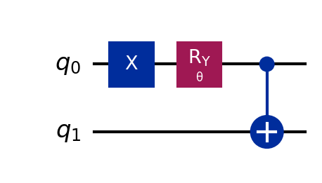
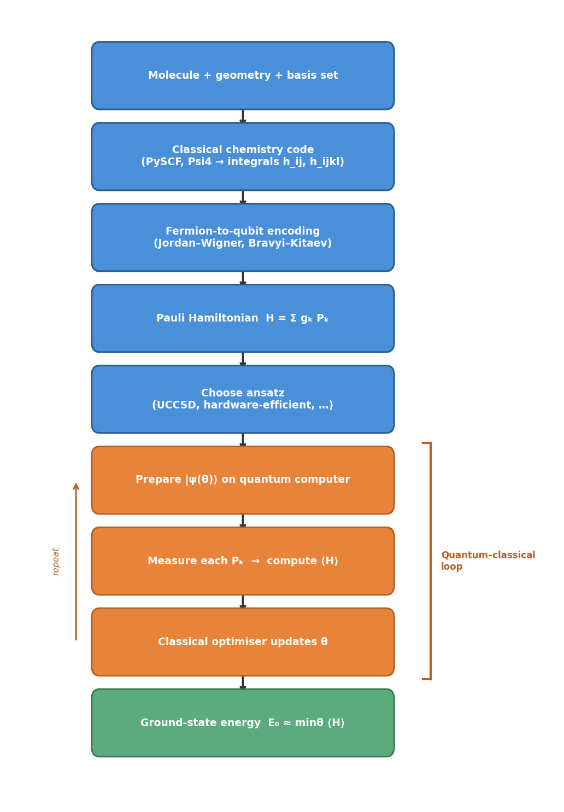

# Deep-Dive 3: The VQE Pipeline

_This deep dive pairs with Unit 3 (Drug Discovery), which explained why molecular simulation is hard and how VQE addresses it. Here we build the VQE pipeline from molecule to energy, step by step._

## In This Chapter

- **What you'll learn:** How electrons become qubits; second quantisation, fermion-to-qubit encodings, Pauli-basis measurement, and the variational optimisation loop that finds the ground-state energy.
- **What you need:** From Deep-Dive 1, you know qubits, superposition, CNOT, and the variational optimisation loop (QAOA). From Deep-Dive 2, you know phase kickback and the idea that quantum operations encode information in phases. Here we add new physics: fermions.
- **Runnable version:** The companion notebook [`03-drug-discovery.ipynb`](../notebooks/03-drug-discovery.ipynb) runs H₂ VQE on a cloud Quokka.

## Why electrons aren't qubits

In Chapters 2 and 4, qubits were abstract binary variables; node colours in MaxCut, input bits in Shor's algorithm. We could assign any meaning we wanted to $|0\rangle$ and $|1\rangle$.

Electrons are different. They obey rules that qubits don't, and ignoring these rules gives wrong answers. The central rule is:

**Electrons are fermions.** The wavefunction of a multi-electron system must be *antisymmetric* — swapping any two electrons flips the sign:

$$\Psi(\ldots, \mathbf{r}_i, \ldots, \mathbf{r}_j, \ldots) = -\Psi(\ldots, \mathbf{r}_j, \ldots, \mathbf{r}_i, \ldots)$$

This minus sign *is* the Pauli exclusion principle: two electrons can't be in the same state (if they were, swapping them would change nothing, but the minus sign says the wavefunction must flip; the only function equal to its own negative is zero).

Qubits don't have this rule. If you swap two qubits, no minus sign appears — the state is unchanged. If we naively map electrons to qubits — electron in orbital $i$ → qubit $i$ is $|1\rangle$, not in orbital $i$ → qubit $i$ is $|0\rangle$ — we get the right *occupations* but the wrong *phases*. The standard encoding produces correct energies for H₂, but for larger molecules the missing signs lead to completely wrong results.

> **Common Mistake #1:** "Qubits are quantum, electrons are quantum, so mapping is trivial." No. Swapping two qubits produces no sign change. Swapping two electrons produces a minus sign. The encoding must bridge this gap. This is the entire subject of the companion book [*From Molecules to Qubits*](https://github.com/johnazariah/encodings-book).

## Second quantisation: the language of electrons

### Occupation numbers

Instead of tracking *where* each electron is (first quantisation), we track *which orbitals are occupied* (second quantisation). For a molecule with $M$ spin-orbitals, the state is described by an occupation vector:

$$|n_0, n_1, \ldots, n_{M-1}\rangle$$

where $n_i = 0$ (orbital empty) or $n_i = 1$ (orbital occupied). For H₂ in a minimal basis: 4 spin-orbitals, 2 electrons. A possible state: $|1, 1, 0, 0\rangle$ (the two lowest orbitals occupied).

This looks like qubits! And it is: each orbital maps to one qubit, with $|1\rangle$ meaning "occupied." But the antisymmetry rule means the *ordering* of orbitals matters. $|1, 1, 0, 0\rangle$ and $|0, 0, 1, 1\rangle$ are not related by a simple swap; the sign depends on how many occupied orbitals you "pass through" to move an electron.

### Creation and annihilation operators

The tools that respect antisymmetry are **creation** ($a_i^\dagger$) and **annihilation** ($a_i$) operators. The symbol $\dagger$ ("dagger") denotes the Hermitian conjugate — roughly, the quantum version of transposing and complex-conjugating a matrix:

- $a_i^\dagger$ creates an electron in orbital $i$ (flips qubit $i$ from $|0\rangle$ to $|1\rangle$, with sign adjustments)
- $a_i$ removes an electron from orbital $i$ (flips $|1\rangle$ to $|0\rangle$, with sign adjustments)

The key property — the thing that encodes the minus sign — is the **anticommutation relation**:

$$\{a_i, a_j^\dagger\} \equiv a_i a_j^\dagger + a_j^\dagger a_i = \delta_{ij}$$

The curly braces $\{A, B\} \equiv AB + BA$ denote the *anticommutator* — unlike the commutator $[A,B] = AB - BA$ you may know from Pauli algebra. And $\delta_{ij}$ is the Kronecker delta: 1 when $i = j$, 0 otherwise.

What does this say? Creating electron $j$ then destroying electron $i$ is *not the same* as destroying $i$ then creating $j$ — they differ by a sign (unless $i = j$). This is the mathematical expression of the Pauli exclusion principle.

### The molecular Hamiltonian

In second quantisation, the molecular Hamiltonian is:

$$H = \sum_{ij} h_{ij} \, a_i^\dagger a_j + \frac{1}{2} \sum_{ijkl} h_{ijkl} \, a_i^\dagger a_j^\dagger a_k a_l$$

The first sum is the **one-electron terms** (kinetic energy + electron-nucleus attraction). The second sum is the **two-electron terms** (electron-electron repulsion). The coefficients $h_{ij}$ and $h_{ijkl}$ are called **molecular integrals** — they come from classical quantum chemistry computations and depend on the molecule's geometry and its **basis set** (the finite set of mathematical functions used to approximate orbitals, like choosing how many Fourier terms to keep in a series).

For H₂ in STO-3G (a minimal basis set: 3 Gaussian functions per orbital): there are about 15 unique molecular integrals. For a drug-sized molecule: millions. But the Hamiltonian always has this same structure — sums of products of creation and annihilation operators, weighted by integrals.

## Fermion-to-qubit encodings

### The problem

We have a Hamiltonian written in terms of $a_i^\dagger$ and $a_i$ (which obey anticommutation rules). We need to express it in terms of Pauli operators $X, Y, Z, I$ (which obey commutation rules). The encoding translates between these two algebras.

### Jordan-Wigner: the simplest encoding

The **Jordan-Wigner** encoding (1928; older than quantum computing!) maps each orbital to one qubit. The occupation number is stored directly: orbital $i$ occupied → qubit $i$ is $|1\rangle$.

The creation operator becomes:

$$a_i^\dagger \to \frac{1}{2}(X_i - iY_i) \otimes Z_{i-1} \otimes Z_{i-2} \otimes \cdots \otimes Z_0$$

Here $\otimes$ is the **tensor product** — it combines operators on separate qubits into one multi-qubit operator. (The $Z_0 Z_1$ you saw in QAOA is shorthand for $Z_0 \otimes Z_1$.) The factor $\frac{1}{2}(X_i - iY_i)$ is called the **raising operator** — it flips $|0\rangle$ to $|1\rangle$ (creating an electron) and annihilates $|1\rangle$ (gives zero — you can't create an electron in an orbital that's already occupied).

The string of $Z$ operators is the price we pay for antisymmetry. Each $Z_k$ checks whether orbital $k$ is occupied; if it is, it contributes a minus sign. This enforces the rule that creating an electron "past" occupied orbitals picks up the right number of minus signs.

Example: $a_2^\dagger$ in a 4-qubit system is $\frac{1}{2}(X_2 - iY_2) \otimes Z_1 \otimes Z_0$. If orbitals 0 and 1 are both occupied, the two $Z$ operators each contribute $-1$, and the total sign is $(-1)^2 = +1$. If only orbital 0 is occupied, the sign is $(-1)^1 = -1$.

### What the Hamiltonian looks like after encoding

Each fermionic term $a_i^\dagger a_j$ becomes a sum of Pauli strings. For H₂ with Jordan-Wigner, the full Hamiltonian decomposes into about 15 terms:

$$H = g_0 I + g_1 Z_0 + g_2 Z_1 + g_3 Z_0 Z_1 + g_4 X_0 X_1 + g_5 Y_0 Y_1 + \cdots$$

Each $g_k$ is a real number computed from the molecular integrals. The Hamiltonian is now a weighted sum of Pauli operators; exactly the kind of thing we know how to measure on a quantum computer.

### The locality problem

The $Z$ string in Jordan-Wigner means a single fermionic operator can touch *all* qubits. For orbital $i$, the string has length $i$. For the last orbital in a 100-qubit system, the string is 100 qubits long.

**Bravyi-Kitaev** encoding improves this: the longest string is $O(\log n)$ instead of $O(n)$. The tradeoff: the mapping between occupation numbers and qubit states is more complex (it uses a binary tree structure). Other encodings (parity, ternary tree, compact) make different tradeoffs.

For the full story; including the algebraic structure behind all encodings, tapering to reduce qubit count, and benchmarks; see [*From Molecules to Qubits*](https://github.com/johnazariah/encodings-book).

## Measuring the energy

### The variational principle

VQE uses the **variational principle**: for any quantum state $|\psi\rangle$, the expected energy is an upper bound on the true ground-state energy:

$$E_0 \leq \langle \psi | H | \psi \rangle$$

Equality holds only when $|\psi\rangle$ is the ground state. So: prepare trial states, measure their energy, and minimise. The minimum you find is your best estimate of $E_0$.

### Decomposing the energy measurement

The Hamiltonian is $H = \sum_k g_k P_k$ where each $P_k$ is a Pauli string (like $Z_0 Z_1$ or $X_0 X_1$). The expected energy is:

$$\langle H \rangle = \sum_k g_k \langle P_k \rangle$$

We measure each $\langle P_k \rangle$ separately. The total energy is the weighted sum.

### Measuring Pauli strings

How do you measure $\langle Z_0 Z_1 \rangle$? Run the circuit, measure both qubits in the computational basis, compute $z_0 \cdot z_1$ where $z_i = +1$ if you measured $|0\rangle$ and $z_i = -1$ if you measured $|1\rangle$. Average over many shots.

How do you measure $\langle X_0 X_1 \rangle$? You can't measure $X$ directly in the computational basis. But applying a Hadamard before measurement rotates $X$ into $Z$:

$$H X H = Z$$

So: apply $H$ to both qubits, then measure in the computational basis. The result gives $\langle X_0 X_1 \rangle$.

How do you measure $\langle Y_0 Y_1 \rangle$? Apply $S^\dagger$ then $H$ to each qubit before measuring in the computational basis. This rotates the measurement axis from $Z$ to $Y$, letting you estimate $\langle Y \rangle$ from computational-basis measurement results.

Each distinct measurement basis requires a separate circuit execution. This is the **measurement overhead**; for $T$ Pauli terms in the Hamiltonian, you need at least $T$ different circuit runs (reducible by grouping commuting terms).

> **Common Mistake #2:** "VQE measures the energy with one circuit." No. The Hamiltonian is a *sum* of terms. Each term (or group of commuting terms) requires its own measurement circuit. For molecules with thousands of Pauli terms, this is a major cost; potentially requiring billions of total measurement shots for acceptable statistical precision.

## The ansatz: parameterised chemistry

### What an ansatz is

The **ansatz** is the parameterised quantum circuit that prepares trial wavefunctions. In QAOA (Deep-Dive 1), the ansatz was the alternating problem/mixer layers with parameters $\gamma, \beta$. In VQE, the ansatz is motivated by chemistry.

### Starting point: the Hartree-Fock state

The simplest starting point is the **Hartree-Fock state** — the best approximation that treats each electron as independent. For H₂: two electrons in the two lowest spin-orbitals:

$$|\text{HF}\rangle = |1100\rangle$$

In circuit terms: `x q[0]; x q[1];` (flip qubits 0 and 1 from $|0\rangle$ to $|1\rangle$).

### Adding correlation: excitations

The Hartree-Fock state ignores electron correlation; it treats each electron as if it moves in the average field of all others. To capture correlation, we apply **excitation operators**: controlled rotations that mix in states where electrons have been moved to different orbitals.

A **single excitation** $a_i^\dagger a_j$ moves one electron from orbital $j$ to orbital $i$. A **double excitation** $a_i^\dagger a_j^\dagger a_k a_l$ moves two electrons. The UCCSD (Unitary Coupled Cluster with Singles and Doubles) ansatz applies all possible singles and doubles with tunable amplitudes:

$$|\psi(\theta)\rangle = e^{\sum_{ij} \theta_{ij}^{(1)} (a_i^\dagger a_j - \text{h.c.})} \cdot e^{\sum_{ijkl} \theta_{ijkl}^{(2)} (a_i^\dagger a_j^\dagger a_k a_l - \text{h.c.})} |\text{HF}\rangle$$

Here "h.c." stands for **Hermitian conjugate** — the dagger of the preceding term. Writing $A - \text{h.c.}$ means $A - A^\dagger$, which makes the exponent anti-Hermitian and ensures $e^{A - A^\dagger}$ is unitary (a valid quantum gate). The exponential of an operator is defined by its Taylor series: $e^A = I + A + A^2/2 + \cdots$

After encoding, each excitation becomes a sequence of CNOTs and parameterised rotations.

### For H₂: one parameter

H₂ has only one relevant double excitation — moving both electrons from the **bonding orbital** (lower energy, electron density concentrated between the two nuclei) to the **antibonding orbital** (higher energy, a node between the nuclei). So the entire ansatz is:

One parameter $\theta$, one CNOT. The simplest possible VQE circuit; but it captures the essential physics: at the optimal $\theta$, the energy matches the exact result to chemical accuracy.

## The classical optimiser

The same variational loop from Deep-Dive 1 (QAOA):

1. Choose parameters $\theta$
2. Prepare $|\psi(\theta)\rangle$ on the quantum computer
3. Measure each Pauli term → compute $\langle H \rangle$
4. Feed $\langle H \rangle$ to a classical optimiser:
   - **COBYLA** (gradient-free — doesn't need derivatives)
   - **L-BFGS** (gradient-based — faster when gradients are available)
   - **SPSA** (stochastic gradient estimate — popular on noisy hardware because it needs only two circuit evaluations per step)
5. Optimiser suggests new $\theta$
6. Repeat until convergence

The variational principle guarantees $\langle H \rangle \geq E_0$; every measurement is an upper bound. The optimiser's job is to tighten the bound.

For H₂ (one parameter), the landscape is a smooth function of $\theta$ — a simple 1D minimisation. For larger molecules with hundreds of parameters, the landscape is much rougher, and gradient-based optimisers need the **parameter-shift rule** to estimate gradients from circuit measurements: evaluate the circuit at two shifted parameter values ($\theta + \pi/2$ and $\theta - \pi/2$) and take the difference.

## Putting it all together

The complete VQE pipeline:

Every step is well-defined. The pipeline works for any molecule; only the integrals and the circuit size change. H₂ needs 2–4 qubits. Caffeine needs ~100. A drug-protein complex needs thousands; beyond current hardware but within the scope of fault-tolerant machines.

The companion notebook runs the full H₂ pipeline end-to-end — computing molecular integrals, building the qubit Hamiltonian, constructing the VQE ansatz, and sweeping the bond length to produce the potential energy surface.

→ **See [notebook `03-drug-discovery.ipynb`](../notebooks/03-drug-discovery.ipynb) for the runnable version.**

## What you should take away

1. **Electrons are fermions, not qubits.** The antisymmetry of the fermionic wavefunction requires an encoding (Jordan-Wigner, Bravyi-Kitaev, etc.) that maps fermionic operators to Pauli operators with the correct signs.

2. **The Hamiltonian becomes a sum of Pauli strings.** After encoding, the molecular energy is just a weighted sum of measurable quantities; each Pauli string can be estimated from repeated measurements.

3. **Measurement has a cost.** Each distinct Pauli basis requires a separate circuit execution. For large molecules, the measurement overhead can dominate the total computation time.

4. **The ansatz encodes chemical intuition.** Good ansätze (like UCCSD) start from the Hartree-Fock state and apply physically motivated excitations. Bad ansätze miss the ground state or suffer from **barren plateaus** — regions where the energy landscape is exponentially flat and the optimiser has no useful gradient to follow.

5. **VQE is the same variational loop as QAOA.** If you understood Deep-Dive 1, you understand VQE's architecture. The difference is the cost function (molecular energy, not graph cuts) and the ansatz (chemistry-motivated, not graph-motivated).

6. **For the full encoding story,** see [*From Molecules to Qubits*](https://github.com/johnazariah/encodings-book).
