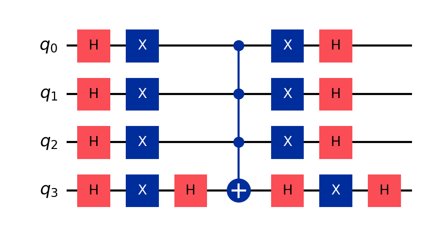

# Deep-Dive 5: Amplitude Estimation from Grover

_This deep dive pairs with Unit 5 (Finance), which explained why Monte Carlo pricing is slow and how quantum amplitude estimation offers a quadratic speedup. Here we build the amplitude estimation circuit from Grover's algorithm._

## In This Chapter

- **What you'll learn:** How Grover's algorithm works geometrically, how quantum amplitude estimation extracts probabilities, and why the quadratic speedup matters for Monte Carlo.
- **What you need:** From Deep-Dive 2, you know the controlled-powers-plus-inverse-QFT pattern that extracts eigenvalues from a unitary operator (that pattern is called **Quantum Phase Estimation**, or QPE). From Deep-Dive 1, you know the ZZ gate and the variational loop. Here we apply QPE to a new operator — the Grover iterator — and the eigenvalue it extracts encodes a probability rather than a period.
- **Runnable version:** The companion notebook [`05-finance.ipynb`](../notebooks/05-finance.ipynb) demonstrates amplitude estimation on a cloud Quokka.

## Grover's algorithm: the geometric picture

### The search problem

You have a function $f:\{0,1\}^n \to \{0,1\}$ with $M$ "marked" inputs (where $f(x) = 1$) among $N = 2^n$ total. Find a marked input.

Classically: $O(N/M)$ queries (check inputs one by one). Quantumly: $O(\sqrt{N/M})$ queries. Quadratic speedup.

### Two subspaces

Define two states:

$$|\text{good}\rangle = \frac{1}{\sqrt{M}} \sum_{x: f(x)=1} |x\rangle, \quad |\text{bad}\rangle = \frac{1}{\sqrt{N-M}} \sum_{x: f(x)=0} |x\rangle$$

The initial uniform superposition lies in the plane spanned by these two states:

$$|s\rangle = \sin\theta\,|\text{good}\rangle + \cos\theta\,|\text{bad}\rangle$$

where $\sin\theta = \sqrt{M/N}$. For $M \ll N$ (a needle in a haystack), $\theta$ is small; the initial state is almost entirely $|\text{bad}\rangle$.

### The Grover iterator as a rotation

The Grover iterator $G$ consists of two reflections:

1. **Oracle reflection** $S_f$: flip the phase of marked states. $S_f|x\rangle = (-1)^{f(x)}|x\rangle$. This is phase kickback from Deep-Dive 2; the oracle marks solutions by flipping their phase.

2. **Diffusion** $S_0 = 2|s\rangle\langle s| - I$: reflect about the mean amplitude. Here $|s\rangle\langle s|$ is an **outer product** — it produces an operator (a matrix), not a number. Applied to any state $|\psi\rangle$, it gives $|s\rangle\langle s|\psi\rangle = \langle s|\psi\rangle \cdot |s\rangle$: project onto $|s\rangle$, scaled by the overlap. (The notation $\langle s|$ is called a **bra** — the row-vector partner of the ket $|s\rangle$, obtained by taking the adjoint.) So $2|s\rangle\langle s| - I$ doubles the component along $|s\rangle$ and subtracts the original — a reflection about $|s\rangle$. In circuit terms: $H^{\otimes n} \cdot (2|0\rangle\langle 0| - I) \cdot H^{\otimes n}$.

Two reflections make a rotation. $G = S_0 \cdot S_f$ rotates the state by angle $2\theta$ toward $|\text{good}\rangle$ in the 2D plane:

$$G^k|s\rangle = \sin((2k+1)\theta)\,|\text{good}\rangle + \cos((2k+1)\theta)\,|\text{bad}\rangle$$

After $k_\text{opt} = \lfloor \pi / (4\theta) \rfloor$ iterations, the state is nearly $|\text{good}\rangle$. Measure → get a marked item with probability $\geq 1 - O(M/N)$.

> **The key insight:** Grover doesn't search. It *rotates*. The search space isn't explored one item at a time; the quantum state rotates continuously from "mostly bad" to "mostly good." The number of rotations needed is $O(1/\theta) = O(\sqrt{N/M})$.

### The oracle circuit

For the financial application (Unit 5), the full construction encodes the normalised payoff into an ancilla amplitude: for each discretised price $|x\rangle$, rotate an ancilla qubit so that the state becomes $\sqrt{1 - f(x)}|0\rangle + \sqrt{f(x)}|1\rangle$, where $f(x) = \max(\text{price}(x) - K, 0) / P_{\max}$ is the normalised payoff. The probability of measuring the ancilla in $|1\rangle$ is then $f(x)$ (not $f(x)^2$), so QAE extracts $\mathbb{E}[f(X)]$ — the normalised expected payoff — which is rescaled by $P_{\max}$ to give the option price.

The companion notebook demonstrates a simplified version using a comparator oracle that marks in-the-money states ($S_T > K$). This estimates the exercise probability rather than the full expected payoff, but it illustrates the same Grover + QAE pipeline with a simpler circuit.

### The diffusion circuit

The diffusion operator $2|s\rangle\langle s| - I$ is implemented as:

The pattern is: Hadamard all qubits, flip all qubits ($X$), apply a **multi-controlled $Z$** (which flips the phase only when all qubits are $|1\rangle$ — decomposed as $H$ + multi-controlled $X$ + $H$ on the last qubit), then undo the $X$ and $H$ layers. This is the most gate-intensive part of Grover's algorithm, but it's a fixed overhead per iteration.

## From Grover to amplitude estimation

### The connection

Grover's algorithm uses $G$ to *find* marked items. But the angle $\theta$; which determines how many iterations are needed; also encodes the *fraction* of marked items: $\sin^2\theta = M/N$.

**Quantum Amplitude Estimation** (QAE) extracts $\theta$ directly, without finding any specific marked item. This is exactly what we need for Monte Carlo pricing: we don't want a specific market scenario, we want the *expected payoff* across all scenarios.

### QPE on the Grover operator

In Deep-Dive 2, we used a pattern — controlled powers of a unitary, followed by the inverse QFT — to extract the period of $a^x \bmod N$. That pattern is **Quantum Phase Estimation** (QPE), and it works for any unitary operator: if $U|v\rangle = e^{i\phi}|v\rangle$, QPE extracts $\phi$.

Here we apply QPE to the Grover iterator $G$, which has eigenvalues $e^{\pm 2i\theta}$. The recipe is identical:

1. Prepare ancilla qubits in $|+\rangle$ (via Hadamard)
2. Apply controlled-$G^{2^k}$ operations (controlled by ancilla qubit $k$)
3. Apply inverse QFT to the ancillas
4. Measure → get an estimate of $\theta$

From $\theta$: compute $\tilde{a} = \sin^2\theta \approx M/N$. This is the amplitude (probability) we want.

### The convergence advantage

With $m$ ancilla qubits, QPE estimates $\theta$ to precision $O(1/2^m)$. This requires $O(2^m)$ applications of the Grover operator $G$.

Each application of $G$ is one "query" to the oracle. So:

- **Precision $\epsilon$** requires $O(1/\epsilon)$ queries
- **Classical Monte Carlo** requires $O(1/\epsilon^2)$ samples for the same precision

The quadratic advantage: same accuracy, quadratically fewer queries.

| Target precision | Classical samples | Quantum queries | Speedup |
|:---|:---|:---|:---|
| $10^{-1}$ | 100 | 10 | 10× |
| $10^{-3}$ | $10^6$ | $10^3$ | 1,000× |
| $10^{-6}$ | $10^{12}$ | $10^6$ | $10^6$× |

The companion notebook runs amplitude estimation end-to-end — constructing the Grover oracle for option pricing, applying QPE, and comparing convergence against classical Monte Carlo.

→ **See [notebook `05-finance.ipynb`](../notebooks/05-finance.ipynb) for the runnable version.**

## What you should take away

1. **Grover's algorithm is a rotation, not a search.** It rotates the quantum state from "mostly wrong" to "mostly right" in the 2D good/bad plane. The number of rotations is $O(\sqrt{N/M})$.

2. **Amplitude estimation = QPE on Grover.** The angle $\theta$ that controls Grover encodes the probability $\sin^2\theta = M/N$. QPE extracts $\theta$ with precision $O(1/2^m)$ using $O(2^m)$ queries.

3. **The quadratic speedup is $1/\epsilon$ vs. $1/\epsilon^2$.** This transforms Monte Carlo from "days on a cluster" to "seconds on a quantum computer" for high-precision estimates.

4. **Phase kickback appears again.** The oracle uses it (Deep-Dive 2). The Grover iterator uses it. QPE uses it. It's the same mechanism at every level.

5. **The circuit depth is the bottleneck.** QAE requires $O(1/\epsilon)$ sequential applications of the full Grover operator. Each application includes the oracle circuit. For useful precision, this means deep circuits; a fault-tolerant algorithm.
