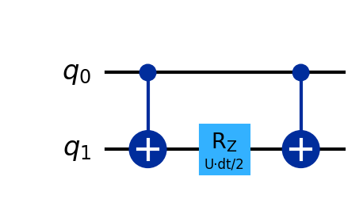

# Deep-Dive 7: QPE and Trotterisation

_This deep dive pairs with Unit 7 (Materials Science), which explained why the Hubbard model defeats classical methods and how QPE could solve it. Here we build QPE and the Trotter time-evolution circuit from the components introduced in earlier deep dives._

## In This Chapter

- **What you'll learn:** How QPE extracts exact energy eigenvalues, how Trotterisation approximates time evolution as a circuit, and how to estimate the resources needed for real materials simulation.
- **What you need:** From Deep-Dive 2 (Shor), you know the QFT and phase kickback. From Deep-Dive 1 (QAOA), you know the ZZ gate and CNOT sandwich. Here we combine them for Hamiltonian simulation.
- **Runnable version:** The companion notebook [`07-materials-science.ipynb`](../notebooks/07-materials-science.ipynb) runs QPE on a 2-site Hubbard model on a cloud Quokka.

## QPE: from phases to eigenvalues

### What we're after

In Deep-Dive 2, we used controlled powers of a unitary plus the inverse QFT to extract the period of $a^x \\bmod N$. That was QPE applied to modular exponentiation. Here we apply exactly the same pattern to a *physical* Hamiltonian — and the quantity it extracts is the energy of a material.

Quantum Phase Estimation answers the question: given a unitary operator $U$ and one of its eigenstates $|\psi\rangle$ (with $U|\psi\rangle = e^{2\pi i \phi}|\psi\rangle$), what is the eigenvalue phase $\phi$?

For Hamiltonian simulation: $U = e^{-iHt}$ and the eigenvalue is $e^{-iEt}$, so $\phi = -Et/(2\pi)$. Measuring $\phi$ gives us the energy $E$.

### The circuit

QPE uses $m$ **ancilla qubits** — helper qubits used as a measurement instrument, separate from the system being studied — for $m$ bits of precision, along with one system register:

1. **Hadamard** all ancillas → superposition
2. **Controlled-$U^{2^k}$** for each ancilla qubit $k$ → phase accumulation
3. **Inverse QFT** on the ancillas → converts phases to a binary number
4. **Measure** the ancillas → read out $\phi$

Steps 1, 3, and 4 we've seen before. The inverse QFT is the QFT from Deep-Dive 2, run backwards (swap the order of gates, negate the rotation angles). Step 2 is the new ingredient.

### Controlled-$U^{2^k}$

Ancilla qubit $k$ controls the application of $U^{2^k}$ to the system register. If the system is in eigenstate $|\psi\rangle$:

$$\text{c-}U^{2^k}\left(\frac{|0\rangle + |1\rangle}{\sqrt{2}}\right)|\psi\rangle = \frac{|0\rangle + e^{2\pi i \cdot 2^k \phi}|1\rangle}{\sqrt{2}} |\psi\rangle$$

The ancilla picks up a phase proportional to $2^k \phi$. After all $m$ controlled operations, the ancilla register holds:

$$\frac{1}{\sqrt{2^m}} \sum_{k=0}^{2^m-1} e^{2\pi i k \phi} |k\rangle$$

This is exactly the QFT of $|\phi\rangle$. Applying the inverse QFT yields $\phi$ (or its best $m$-bit approximation).

> **Connection to Shor:** In Deep-Dive 2, QPE was implicit — the controlled modular exponentiation + QFT was QPE applied to the modular multiplication operator. Here we make it explicit and apply it to a physically motivated Hamiltonian.

## Trotterisation: implementing $e^{-iHt}$

### The problem

QPE requires controlled applications of $U = e^{-iHt}$. But $H$ is a sum of terms that don't commute:

$$H = H_1 + H_2 + \cdots + H_L$$

We can implement $e^{-iH_k t}$ for each individual term (because each term has a simple structure; products of Pauli operators). But $e^{-iHt} \neq e^{-iH_1 t} \cdot e^{-iH_2 t} \cdots e^{-iH_L t}$ because the terms don't commute.

### First-order Trotter

The **Trotter formula** says: the product of exponentials approximates the exponential of the sum if the time step is small:

$$e^{-iHt} \approx \left(e^{-iH_1 \Delta t} \cdot e^{-iH_2 \Delta t} \cdots e^{-iH_L \Delta t}\right)^{N}$$

where $\Delta t = t/N$. The error is $O(L^2 t^2 \Delta t)$; it goes to zero as $\Delta t \to 0$ (more Trotter steps).

### Second-order Trotter (Suzuki)

A better approximation symmetrises the product:

$$e^{-iHt} \approx \left(e^{-iH_1 \Delta t/2} \cdot e^{-iH_2 \Delta t/2} \cdots e^{-iH_L \Delta t} \cdots e^{-iH_2 \Delta t/2} \cdot e^{-iH_1 \Delta t/2}\right)^{N}$$

The error drops to $O(L^3 t^3 \Delta t^2)$; much better for the same circuit depth. Higher-order formulas exist but add circuit complexity.

### Implementing each term

For the Hubbard model:

**Hopping terms** $c_{i\sigma}^\dagger c_{j\sigma} + \text{h.c.}$: after Jordan-Wigner encoding (Deep-Dive 3), these become $\frac{1}{2}(X_i X_j + Y_i Y_j) \cdot Z_\text{string}$. The time evolution under this term is:

$$e^{-i\theta(X_i X_j + Y_i Y_j)/2}$$

This requires 2 CNOTs mixed with single-qubit rotations — a known decomposition that generalises the ZZ sandwich from Deep-Dive 1.

**Interaction terms** $n_{i\uparrow} n_{i\downarrow}$: after encoding, each becomes $\frac{(1-Z_{i\uparrow})(1-Z_{i\downarrow})}{4}$. This is diagonal; the time evolution is a $ZZ$ phase gate, exactly the CNOT sandwich from Deep-Dive 1:

Every piece of the Trotter circuit is built from gates we already know.

## Resource estimation

### Gate count

For an $L \times L$ Hubbard lattice with $2L^2$ spin-orbitals:

| Component | Gate count |
|:---|:---|
| Hopping terms per Trotter step | $O(L^2)$ CNOTs |
| Interaction terms per Trotter step | $O(L^2)$ CNOTs |
| QFT (for QPE) | $O(m^2)$ controlled rotations |
| Total | $O(m \cdot N_\text{Trotter} \cdot L^2)$ |

For a $10 \times 10$ lattice with **chemical-precision** QPE ($m \approx 20$ bits, giving ~1 milliHartree accuracy — the threshold from Unit 3 where energy differences become chemically meaningful, $N_\text{Trotter} \approx 10^3$): roughly $10^7$ gates on $\sim 200$ qubits.

### Physical qubits

With **surface code** error correction (the leading scheme from Unit 2's Reality Check; physical error rate $10^{-3}$, **code distance** ~20 — the code distance controls how many physical errors can be corrected, with each logical qubit requiring roughly $2d^2 \approx 800$ physical qubits for distance $d = 20$): The $10 \times 10$ Hubbard model needs:

$$200 \text{ logical} \times 800 \text{ physical/logical} \approx 160{,}000 \text{ physical qubits}$$

This is in the same ballpark as the Pinnacle architecture's estimate for RSA-2048 (Unit 2: 100,000 physical qubits). Both are ambitious but plausible targets for the next decade of hardware development.

## What you should take away

1. **QPE = controlled time evolution + inverse QFT.** It extracts energy eigenvalues to arbitrary precision. The QFT (from Deep-Dive 2) and phase kickback (from Deep-Dive 2) do the heavy lifting.

2. **Trotterisation is the bridge between Hamiltonians and circuits.** It breaks $e^{-iHt}$ into a product of simple operations — each implemented with the gates from Deep-Dive 1 (ZZ sandwich for diagonal terms) and generalisations for off-diagonal terms.

3. **The circuit is deep but structured.** Every gate in a Trotter circuit has a physical meaning: it simulates one interaction in the Hamiltonian for one time step. More accuracy → more Trotter steps → deeper circuit.

4. **Resource estimates are concrete.** For the 2D Hubbard model: ~200 qubits, ~$10^7$ gates, ~$10^5$ physical qubits with error correction. These numbers define the engineering targets.

5. **Everything connects.** QPE reuses the QFT from Deep-Dive 2 (Shor). Trotterisation reuses the ZZ gate from Deep-Dive 1 (QAOA). The fermionic encoding comes from Deep-Dive 3 (VQE). This is where the threads converge.

## Beyond Trotter: qubitization

Trotterisation is not the only way to implement $e^{-iHt}$ for QPE. A fundamentally different approach called **qubitization** (Low and Chuang, 2019) avoids Trotter error entirely by encoding the Hamiltonian as a *block* of a larger unitary — a technique called a **block encoding**. Instead of approximating $e^{-iHt}$ with a product of simple gates (introducing Trotter error that must be controlled), qubitization constructs a unitary operator whose eigenvalues are *exact functions* of the Hamiltonian's eigenvalues.

The practical consequence: qubitization-based algorithms like **quantum signal processing** (QSP) and **quantum singular value transformation** (QSVT) achieve optimal query complexity — they use the minimum number of oracle calls provably necessary to estimate eigenvalues to a given precision. For Hamiltonian simulation, this means asymptotically fewer gates than any Trotter formula.

The tradeoff: qubitization requires more ancilla qubits and a more complex circuit structure (the block encoding of $H$). For near-term and early fault-tolerant devices, Trotterisation may still be more practical due to its simpler circuits. But for the long-term fault-tolerant regime, qubitization is the theoretically optimal approach.

- Low and Chuang (2019). *Hamiltonian Simulation by Qubitization.* [Quantum 3:163](https://doi.org/10.22331/q-2019-07-12-163) ([arXiv:1610.06546](https://arxiv.org/abs/1610.06546))
- Gilyen, Su, Low, Wiebe (2019). *Quantum singular value transformation and beyond: exponential improvements for quantum matrix arithmetics.* [STOC 2019](https://doi.org/10.1145/3313276.3316366) ([arXiv:1806.01838](https://arxiv.org/abs/1806.01838))
