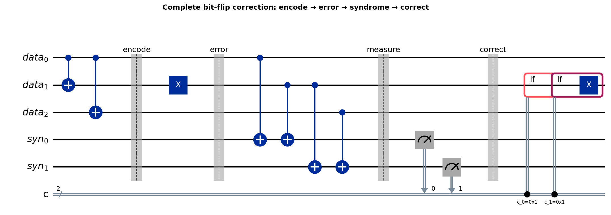
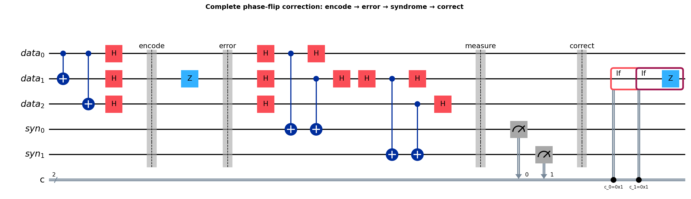
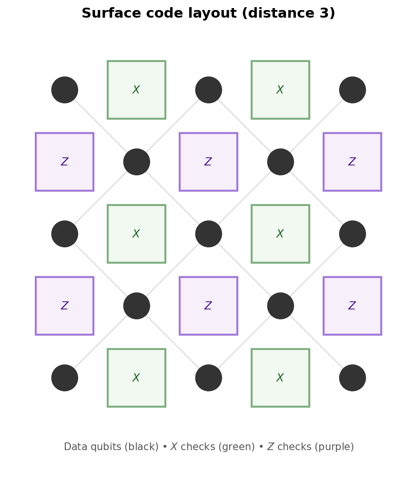
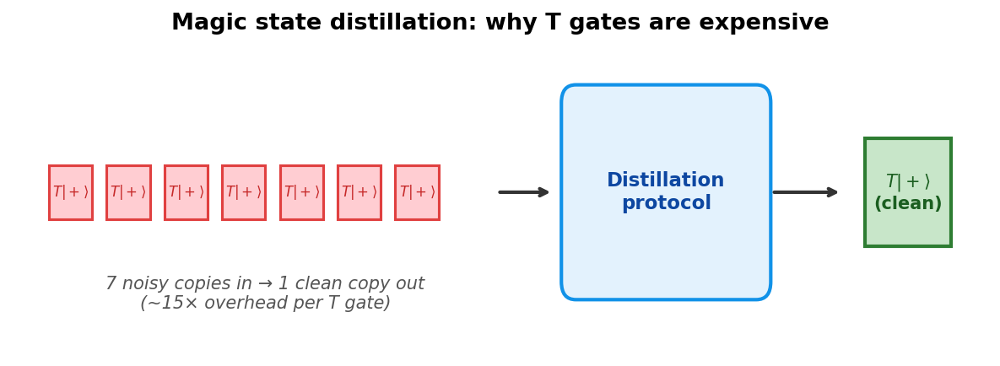

# Deep-Dive 9: Inside Quantum Error Correction

_This deep dive pairs with the preceding chapter (The Elephant in the Room), which explained why quantum computers make mistakes and what error correction buys you. Here we open the box and show how it actually works — from the simplest three-qubit code to the stabiliser formalism that underlies every modern error-correcting scheme._

## In This Chapter

- **What you'll learn:** How to detect and correct quantum errors without measuring the encoded state, how the Pauli operators you already know form the mathematical backbone of error correction, and why fault-tolerant gates are hard.
- **What you need:** Pauli operators $X$, $Y$, $Z$ (Unit 1 and Deep-Dive 1), CNOT (Deep-Dive 1), measurement (Unit 1), and the idea that quantum operations must be reversible (Deep-Dive 2). Everything else is built here.

## The problem, concretely

A single qubit in state $\alpha|0\rangle + \beta|1\rangle$ can suffer three kinds of error:

- **Bit flip** ($X$ error): $|0\rangle \leftrightarrow |1\rangle$. Like a classical bit flip.
- **Phase flip** ($Z$ error): $|0\rangle \to |0\rangle$, $|1\rangle \to -|1\rangle$. No classical analogue — it changes the *phase*, not the bit value.
- **Both** ($Y = iXZ$ error): a bit flip and a phase flip together.

Any single-qubit error can be decomposed as a combination of $I$, $X$, $Y$, $Z$. So if we can correct $X$ and $Z$ errors separately, we can correct *any* single-qubit error. This is the key insight that makes quantum error correction possible despite the continuous nature of quantum states.

But we can't just *check* the qubit to see if it's wrong — measurement destroys the superposition. We need to detect errors *without learning the state*.

## The bit-flip code: your first quantum error-correcting code

### Encoding

Encode one logical qubit into three physical qubits:

$$|0\rangle_L = |000\rangle, \qquad |1\rangle_L = |111\rangle$$

A general state $\alpha|0\rangle + \beta|1\rangle$ becomes $\alpha|000\rangle + \beta|111\rangle$. This is *not* three copies of the qubit (that would violate the no-cloning theorem). It's one logical qubit spread across three physical qubits — the superposition coefficients $\alpha$ and $\beta$ are preserved in the *correlations* between the three qubits, not in any individual one.

The encoding circuit uses two CNOTs, but let's see the *entire* correction cycle at once — encoding, error, syndrome extraction, and correction — in a single circuit:

Read left to right through four stages:

**Encode:** Two CNOTs spread the data qubit across three physical qubits: $\alpha|0\rangle + \beta|1\rangle \to \alpha|000\rangle + \beta|111\rangle$. This is *not* three copies (that would violate no-cloning). It's one logical qubit whose information lives in the *correlations* between the three qubits.

**Error:** A bit flip ($X$) hits qubit 2. The state becomes $\alpha|010\rangle + \beta|101\rangle$. We don't know this has happened — that's the point.

**Syndrome:** Two ancilla qubits measure the parity of qubit pairs via CNOTs. $Z_1 Z_2$ checks whether qubits 1 and 2 agree; $Z_2 Z_3$ checks qubits 2 and 3. Crucially, these parity checks reveal which qubit *disagrees* without revealing whether the logical state is $|0\rangle_L$ or $|1\rangle_L$:

| Measurement | What it checks | No error | Qubit 1 flipped | Qubit 2 flipped | Qubit 3 flipped |
|:---:|:---|:---:|:---:|:---:|:---:|
| $Z_1 Z_2$ | Do qubits 1 and 2 agree? | $+1$ | $-1$ | $-1$ | $+1$ |
| $Z_2 Z_3$ | Do qubits 2 and 3 agree? | $+1$ | $+1$ | $-1$ | $-1$ |

The pair of outcomes — the **syndrome** — tells you exactly which qubit flipped:

- $(+1, +1)$: no error — do nothing
- $(-1, +1)$: qubit 1 flipped → apply $X_1$ to flip it back
- $(-1, -1)$: qubit 2 flipped → apply $X_2$ to flip it back
- $(+1, -1)$: qubit 3 flipped → apply $X_3$ to flip it back

The correction is just an $X$ gate — the same Pauli-$X$ (bit flip) from Unit 1 — applied to the qubit the syndrome identified. The error was an unwanted $X$; the correction is a deliberate $X$; and $X \cdot X = I$ (applying a bit flip twice returns to the original state). The entire cycle is: **encode → (error happens) → measure syndrome → apply corrective $X$ → state restored.**

Notice that at no point did we learn $\alpha$ or $\beta$. The syndrome told us *where* the error was, not *what the state is*. This is the deep trick: error correction extracts information about the error while remaining ignorant of the encoded data.

This is the same $Z_i Z_j$ operator from the MaxCut Hamiltonian in Unit 1 — but now it's playing a completely different role. In QAOA, it encoded a cost function. Here, it detects errors. Same operator, new purpose.

### What this code *can't* do

The bit-flip code corrects $X$ errors but is blind to $Z$ (phase) errors. If qubit 2 suffers a phase flip — $|0\rangle \to |0\rangle$, $|1\rangle \to -|1\rangle$ — the syndrome measurements both return $+1$ (the parities haven't changed), and the error goes undetected.

We need a code that handles both.

## The phase-flip code

The phase-flip code is the bit-flip code in a different basis. Instead of encoding in the $|0\rangle / |1\rangle$ basis, encode in the $|+\rangle / |{-}\rangle$ basis:

$$|0\rangle_L = |{+}{+}{+}\rangle, \qquad |1\rangle_L = |{-}{-}{-}\rangle$$

Now a phase flip on one qubit ($Z$ error) flips that qubit from $|+\rangle$ to $|{-}\rangle$ (or vice versa) — which is a *bit flip in the Hadamard basis*. The syndrome measurements become $X_1 X_2$ and $X_2 X_3$ instead of $Z_1 Z_2$ and $Z_2 Z_3$, and the correction is a $Z$ gate on the identified qubit (since $Z \cdot Z = I$, just like $X \cdot X = I$).

Here's the full phase-flip correction cycle — compare it with the bit-flip circuit above:

The structure is identical. The only differences: $H$ gates wrap the encoding, the syndrome checks use $X$-basis parity instead of $Z$-basis, and the correction is $Z$ instead of $X$. Everything else — the CNOTs, the ancillas, the classical conditioning — is the same circuit in a different basis.

### The $X$/$Z$/Hadamard duality

This is not a coincidence. There is a deep symmetry at work:

| Bit-flip code | Phase-flip code | Connected by |
|:---|:---|:---:|
| Encodes in $|0\rangle$, $|1\rangle$ | Encodes in $|+\rangle$, $|{-}\rangle$ | $H$ |
| Detects $X$ errors | Detects $Z$ errors | $H$ |
| Syndrome uses $Z_i Z_j$ | Syndrome uses $X_i X_j$ | $H$ |
| Corrects with $X$ | Corrects with $Z$ | $H$ |

The Hadamard gate $H$ swaps the $X$ and $Z$ operators: $HXH = Z$ and $HZH = X$. So *everything* about bit-flip correction transforms into phase-flip correction under $H$, and vice versa. Apply $H$ to every qubit in the bit-flip code, and you get the phase-flip code. Apply $H$ to the syndrome measurements, and $Z_i Z_j$ becomes $X_i X_j$.

This duality runs deeper than error correction. It's the same symmetry that relates the computational basis to the Hadamard basis throughout quantum computing — the QFT generalises it, and phase kickback exploits it. Here, it tells us that bit errors and phase errors are the *same problem in different bases*. Any code that handles one can handle the other by conjugating with $H$.

The Shor code exploits this: it concatenates one code inside the other, catching both error types simultaneously.

## The Shor code: correcting everything

Peter Shor's 9-qubit code (1995) concatenates both ideas: encode against phase flips first (3 physical qubits per block), then encode each block against bit flips (3 blocks of 3 = 9 qubits total).

![Shor [[9,1,3]] encoding circuit: phase-flip encoding (CNOTs + Hadamards) followed by bit-flip encoding within each block](../figures/qec-shor-encode.png)

$$|0\rangle_L = \frac{1}{2\sqrt{2}}(|000\rangle + |111\rangle)(|000\rangle + |111\rangle)(|000\rangle + |111\rangle)$$
$$|1\rangle_L = \frac{1}{2\sqrt{2}}(|000\rangle - |111\rangle)(|000\rangle - |111\rangle)(|000\rangle - |111\rangle)$$

Within each block of 3, the $Z_i Z_j$ parity checks detect bit flips. Between blocks, $X$-basis parity checks detect phase flips. Together, they detect and correct *any* single-qubit error on any of the 9 physical qubits.

9 physical qubits for 1 logical qubit is expensive — an overhead of 9×. Modern codes do better. But the Shor code proved that quantum error correction is *possible*, which was not obvious before 1995. Many physicists believed that the continuous nature of quantum errors (rotations by arbitrary angles, not just discrete flips) would make correction impossible. The Shor code showed that discretising errors into $X$, $Z$, and $Y$ components — and correcting each — handles everything.

## The stabiliser formalism: the algebra behind it all

The bit-flip code, phase-flip code, and Shor code are all examples of **stabiliser codes**. The stabiliser formalism, developed by Gottesman (1997), provides a unified mathematical framework for constructing and analysing quantum error-correcting codes.

### The idea

A stabiliser code is defined by a set of Pauli operators — products of $I$, $X$, $Y$, $Z$ on the physical qubits — called **stabiliser generators**. The code space is the set of states that are $+1$ eigenstates of *every* generator.

For the 3-qubit bit-flip code:
- Generator 1: $Z_1 Z_2$ (qubits 1 and 2 have the same parity)
- Generator 2: $Z_2 Z_3$ (qubits 2 and 3 have the same parity)

The states satisfying both conditions are exactly $\alpha|000\rangle + \beta|111\rangle$ — the code space. An error moves the state *out* of the code space, and the generators' eigenvalues (the syndrome) tell you which error occurred.

### Why it works

The Pauli operators $\{I, X, Y, Z\}^{\otimes n}$ form a group under multiplication (up to phases). Stabiliser generators are elements of this group that commute with each other. The key properties:

1. **Syndrome extraction doesn't disturb the code space.** Measuring a stabiliser generator on a codeword always gives $+1$ — it's an eigenvalue measurement, so the state is unchanged. Only errors change the eigenvalue to $-1$.
2. **Different errors give different syndromes.** If two errors $E_1$ and $E_2$ anticommute with different stabilisers, they produce different syndrome patterns and can be distinguished.
3. **The code corrects $t$ errors if no undetectable error has weight $\leq 2t$.** An undetectable error commutes with all stabilisers. The minimum weight of such an error is the code **distance** $d$, and the code corrects $\lfloor (d-1)/2 \rfloor$ errors.

The 3-qubit bit-flip code has distance 3 (the smallest undetectable bit-flip error is $X_1 X_2 X_3$, which flips all three qubits and maps $|000\rangle \to |111\rangle$). So it corrects 1 error.

### A notation for codes

An $[[n, k, d]]$ code encodes $k$ logical qubits into $n$ physical qubits with distance $d$:

- 3-qubit bit-flip code: $[[3, 1, 3]]$ (corrects 1 $X$ error, but only $X$ errors)
- Shor code: $[[9, 1, 3]]$ (corrects any 1 error)
- Surface code (distance $d$): $[[2d^2, 1, d]]$ (corrects $\lfloor(d-1)/2\rfloor$ errors of any type)

The overhead — the ratio $n/k$ — is the price of protection.

## The surface code: why it wins

The surface code arranges physical qubits on a 2D grid. **Data qubits** sit on the edges; **syndrome qubits** sit on the vertices and faces. Each syndrome qubit measures the parity of its neighbouring data qubits — either $Z$-parity (detecting bit flips) or $X$-parity (detecting phase flips).

The surface code's advantages:

- **Locality.** Every syndrome measurement involves only nearest-neighbour interactions. No long-range connections needed. This matches the connectivity of superconducting and ion-trap hardware.
- **High threshold.** If the physical error rate is below ~1%, errors can be corrected faster than they accumulate. Current hardware is near this threshold.
- **Simple decoding.** The syndrome pattern can be decoded efficiently (in polynomial time) using minimum-weight matching algorithms.

The cost: $2d^2$ physical qubits per logical qubit for distance $d$. At $d = 20$ (enough for many useful computations): ~800 physical qubits per logical qubit. That's why the resource estimates in this book are so large — every logical qubit in QAOA, Shor's algorithm, VQE, or QPE becomes hundreds of physical qubits once you demand reliability.

## Why T-gates are expensive

In Deep-Dive 7, T-gate counts appeared as the standard cost metric for fault-tolerant algorithms. Here's why.

Most quantum gates — $H$, $S$, CNOT, and all Pauli gates — can be implemented **transversally** in the surface code: apply the gate to each physical qubit independently, and the logical gate is automatically correct. Errors don't spread.

The $T$ gate ($\pi/8$ rotation) cannot be done transversally in any code that detects all single-qubit errors. This is the **Eastin-Knill theorem**: no code can implement a universal gate set entirely transversally.

The workaround: **magic state distillation**. Prepare a special auxiliary state ($T|+\rangle$), purify it through a resource-intensive distillation protocol, and use it to implement $T$ via gate teleportation. Each logical $T$ gate requires ~15× more physical qubits and operations than a Clifford gate.

This is why algorithms are optimised to minimise T-gate count. And it's why the resource tables in Units 2 and 7 report T-gates rather than total gates — the T-gates dominate the physical cost.

## What you should take away

1. **Quantum errors decompose into Pauli errors.** Correcting $X$ and $Z$ individually handles everything. This discretisation is what makes quantum error correction possible.

2. **Syndrome measurements detect errors without revealing the state.** The $Z_i Z_j$ parity checks from QAOA's cost Hamiltonian reappear here as error detectors — same operator, different purpose.

3. **The stabiliser formalism is the algebra of Pauli groups applied to coding theory.** A code is defined by commuting Pauli operators; the syndrome is a set of eigenvalues; correction is a Pauli operation conditioned on the syndrome.

4. **The surface code wins on locality and threshold.** Its 2D nearest-neighbour structure matches real hardware, and its ~1% error threshold is within reach.

5. **T-gates are expensive because universality conflicts with transversality.** Magic state distillation is the workaround, and it dominates the physical cost of fault-tolerant computation.

6. **Every resource estimate in this book is ultimately a statement about error correction.** The number of logical qubits times the per-qubit overhead of the code times the number of T-gates times the distillation cost — that's the real hardware bill.

## Beyond stabiliser codes: the frontier

Everything in this chapter — the bit-flip code, the Shor code, the surface code — belongs to the family of **stabiliser codes**, the best-understood and most widely studied class of quantum error-correcting codes. But stabiliser codes are not the end of the story. Quantum error correction is one of the few areas of quantum computing where the *mathematics* is still generating fundamentally new approaches, not just optimising existing ones.

A few directions worth knowing about:

**Quantum LDPC codes** push the overhead down. The surface code uses $O(d^2)$ physical qubits per logical qubit, which means the overhead grows with the protection level. Quantum LDPC codes — the family behind the Pinnacle architecture from Unit 2 — can in principle achieve *constant* overhead: a fixed number of physical qubits per logical qubit, independent of code distance. The tradeoff is connectivity: they require non-local qubit interactions that are harder to build in hardware.

**Colour codes** offer an alternative to surface codes with different transversal gate sets and potentially easier implementation of certain logical operations. They use a three-colourable lattice instead of the surface code's checkerboard.

**Floquet codes** (Hastings and Haah, 2021) use time-varying stabiliser measurements — the code itself changes from one measurement round to the next, but the logical information is preserved. This is a genuinely new idea with no classical analogue.

**Quantum error correction with constant space overhead** (Gottesman, 2014; Fawzi, Grospellier, Leverrier, 2018) establishes that fault-tolerant quantum computation is possible with only a constant factor more physical qubits than logical ones, asymptotically. Realising this in practice is an open engineering challenge.

**Bosonic codes** (cat codes, GKP codes, binomial codes) encode a logical qubit into a single *oscillator mode* rather than into many physical qubits. These are particularly natural for superconducting hardware, where quantum information is stored in microwave cavities.

The field is active and accelerating. New code families are being discovered, new decoders are being designed, and the interplay between codes and hardware architectures is becoming one of the central engineering challenges of quantum computing. The mathematics of quantum error correction — drawing on algebra, topology, combinatorics, and information theory — is richer than any single chapter can convey. What we've covered here is the foundation; the frontier is wide open.
